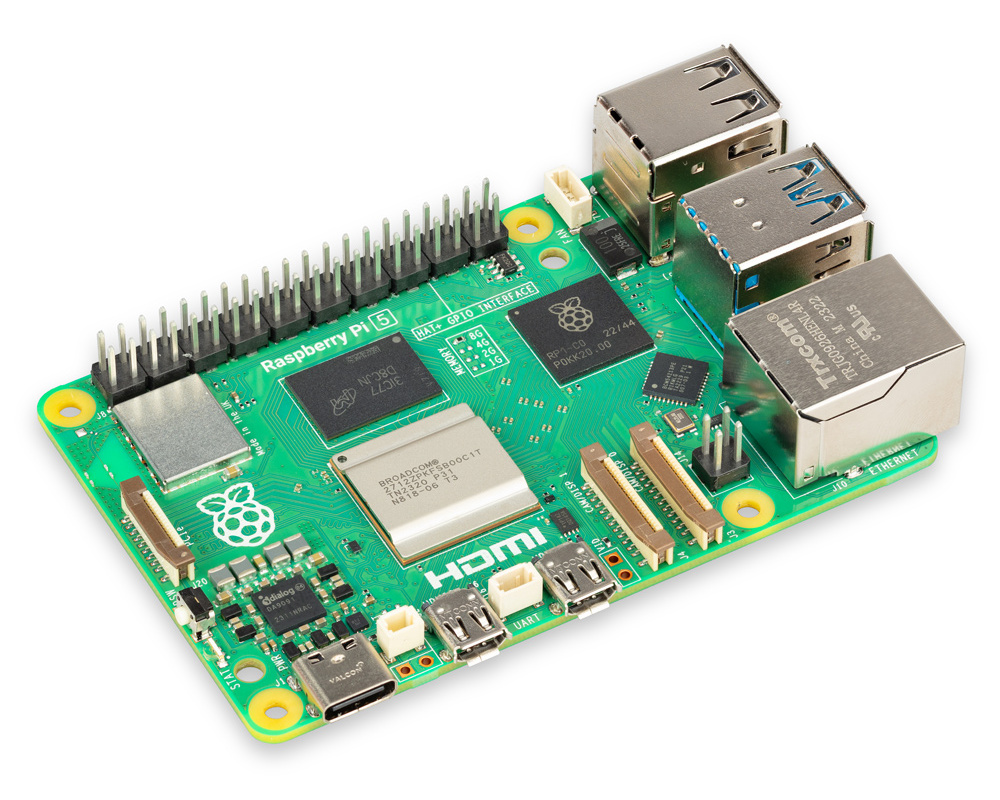
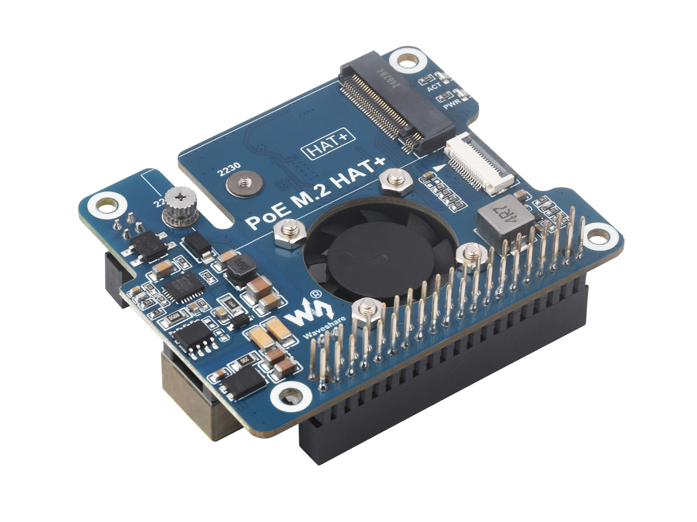
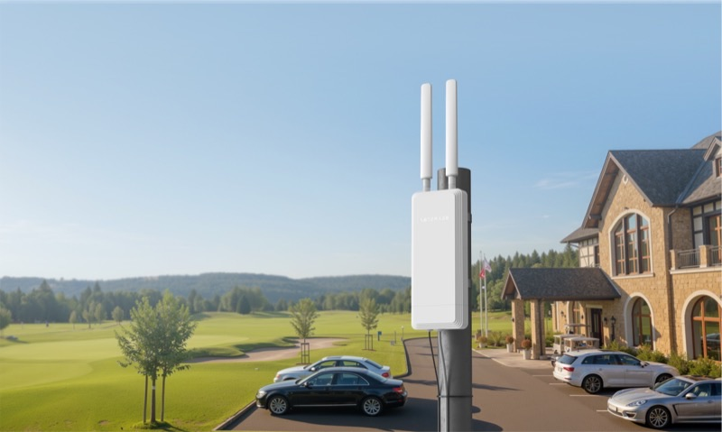

# Список компонентов и настройка серверной части

← [01-overview](01-overview.md) | [Оглавление](smart-greenhouse-design.md) |
[03-greenhouse-installation](03-greenhouse-installation.md) →

---

> Цены ориентировочные для РФ, весна–лето 2025–2026 гг. (Ozon, Яндекс Маркет, iArduino, Чип и Дип,
  профильные магазины). Перед заказом проверяйте актуальную стоимость и наличие.

Сеть Wi‑Fi/Mesh и VLAN — в [§3](01-overview.md#3-настройка-wi-fi-и-mesh). Щит **снаружи у входа**
(~май–сентябрь; зимой снят — [03
§0.1](03-greenhouse-installation.md#01-сезонная-эксплуатация-монтаж-и-демонтаж-щита)), датчики и
камеры **внутри** теплицы (RH 70–95 %), гидравлика — [03](03-greenhouse-installation.md),
[04](04-esp32-and-cabinet.md).

## 1. Подбор компонентов
### 1.1. Серверная часть (дом, сетевой шкаф)



*Рекомендуемая связка ★: Raspberry Pi 5 4 ГБ + Waveshare PoE M.2 HAT+ + NVMe 128 ГБ.*

| Узел | Бюджет | Сбалансированный ★ | Премиум | Поиск / ссылка |
|------|--------|-------------------|---------|----------------|
| Плата HA | Raspberry Pi 4 Model B 4 ГБ | **Raspberry Pi 5 4 ГБ** | Raspberry Pi 5 8 ГБ | `Raspberry Pi 5 4GB купить` — [iArduino](https://www.iarduino.ru/shop/boards/raspberry-pi-5-4gb.html), [robotclass.ru](https://shop.robotclass.ru/) |
| PoE | PoE HAT для Pi 4 (802.3af) | **Waveshare PoE M.2 HAT+ для Pi 5** (802.3at) | Официальный Raspberry Pi PoE+ HAT | `Waveshare PoE M.2 HAT+ Pi 5` |


| Накопитель | USB SSD 128 ГБ (Kingston SA400) + переходник USB 3.0 | **NVMe 128 ГБ 2230** (Kingston NV2 / WD SN580) в M.2 HAT | NVMe 256 ГБ + резервная копия на USB | `NVMe 2230 128GB`, `SSD USB 3.0 128GB` |
| Охлаждение | Пассивный радиатор Pi 4 | **Active Cooler Pi 5** + корпус с вентиляцией шкафа | Корпус Argon NEO 5 + температурный монитор | `Raspberry Pi 5 Active Cooler` |
| ОС | Home Assistant OS (официальный образ) | Home Assistant OS | HA OS + add-on InfluxDB/Grafana | [home-assistant.io/installation](https://www.home-assistant.io/installation/) |
| Альтернатива Pi | Orange Pi 5 / x86 NUC б/у | — | Home Assistant Green (готовое устройство) | `Home Assistant Green купить` |

**Рекомендация ★:** Raspberry Pi 5 4 ГБ + Waveshare PoE M.2 HAT+ + NVMe 128 ГБ. Загрузка с NVMe
надёжнее microSD при постоянной записи истории HA.

| Компонент | Кол-во | Цена ★, ₽ | Сумма, ₽ |
|-----------|--------|-----------|----------|
| Raspberry Pi 5 4 ГБ | 1 | 13 000–15 000 | 14 000 |
| Waveshare PoE M.2 HAT+ | 1 | 3 500–4 500 | 4 000 |
| NVMe 128 ГБ 2230 | 1 | 2 000–2 800 | 2 400 |
| Active Cooler + корпус | 1 | 1 500–2 500 | 2 000 |
| Patch‑cord Cat6 в шкаф | 1 | 200–400 | 300 |
| **Итого сервер** | | | **~22 700** |

---

### 1.2. Сеть Mesh



*Mesh‑узел Stellar 6 (PoE 802.3af) и маршрутизатор Keenetic Speedster в сетевом шкафу; отдельный
PoE‑инжектор не требуется.*

| Узел | Бюджет | Сбалансированный ★ | Премиум |
|------|--------|-------------------|---------|
| Маршрутизатор | Keenetic 4G / Start | **Keenetic Speedster (KN-3013)** | Keenetic Ultra / Giga |
| Mesh‑узел | — | **Netcraze Stellar 6** (уже в наличии) | **Netcraze Stellar 6** (уже в наличии) |
| PoE в шкафу | — | **Keenetic PoE‑коммутатор (уже есть)** — Pi HA (PoE HAT) и Stellar 6, без инжектора | Второй PoE‑коммутатор или порты PoE+ (802.3at) при росте нагрузки |

Поиск: `Keenetic Speedster KN-3013`, `Netcraze Stellar 6 mesh`

**Питание ★:** Stellar 6 поддерживает PoE (802.3af); сервер HA — через Waveshare PoE M.2 HAT+
(802.3at). Оба устройства подключаются к **уже установленному Keenetic PoE‑коммутатору** в сетевом
шкафу патч‑кордами Cat6 (для AP — наружный кабель). Отдельный PoE‑инжектор не требуется.

---

### 1.7. Адресация IoT VLAN (192.168.30.0/24)

Сеть и DHCP — [01-overview.md §3](01-overview.md#3-настройка-wi-fi-и-mesh). Резервирование по MAC на
Keenetic.

| IP | Hostname | Устройство | Документ |
|----|----------|------------|----------|
| 192.168.30.11 | `greenhouse-watering` | ESP32 №1 — полив, бак | [04 §2.2](04-esp32-and-cabinet.md) |
| 192.168.30.12 | `greenhouse-climate` | ESP32 №2 — климат, форточки | [04 §2.3](04-esp32-and-cabinet.md) |
| **192.168.30.13** | **`greenhouse-cv-edge`** | **Edge SBC (Radxa ZERO 3W) — локальный RTSP‑захват, опц. ONNX pre-filter, передача на Pi; без WAN и без Yandex credentials** | [05 §3.4–3.5](05-computer-vision.md) |
| 192.168.30.21 | `greenhouse-cv-entrance` | PoE IP камера CV‑1 | [05 §3.1](05-computer-vision.md) |
| 192.168.30.22 | `greenhouse-cv-far` | PoE IP камера CV‑2 | [05 §3.1](05-computer-vision.md) |
| 192.168.30.100–200 | — | DHCP pool (прочие IoT) | [01 §3](01-overview.md) |

PoE камеры **внутри** теплицы подключены к **Keenetic PoE‑коммутатору** в домашнем шкафу (**Cat6**
через стенку/раму у входа); edge SBC в щите **снаружи** получает RTSP по Wi‑Fi в том же VLAN и
**передаёт JPEG на Pi** (не в Yandex Cloud). **Yandex Object Storage и Foundation Models** — только
с **Raspberry Pi 5 / HA** ([05 §2](05-computer-vision.md#2-архитектура)). ESP32 и полевые линии —
**FTP** из щита в теплицу ([03
§0](03-greenhouse-installation.md#0-щит-снаружи-датчики-и-камеры-внутри)). **Зимой** хосты `.11–.13`
offline (щит в хранении); камеры `.21–.22` — по выбору ([05
§0.1.4](05-computer-vision.md#014-сезонная-эксплуатация-cv)).

**Базовый BOM (~52 000 ₽)** — сервер Pi, щит ESP32, датчики, клапаны; **без** PoE камер и Radxa.
**Опционально CV** (~22 550 ₽ доп.) — см. [05 §11](05-computer-vision.md#11-bom-дополнение).
**Опционально надёжность щита** — Gore vent, силика‑гель, mini UPS 12 V ([04
§1.3](04-esp32-and-cabinet.md)).

---

### 1.6. Сводная стоимость по сценариям

| Категория | Минимальный | Сбалансированный ★ | Максимальный |
|-----------|-------------|-------------------|--------------|
| Сервер HA (Pi + PoE + SSD) | Pi 4 + USB SSD ~15 000 | Pi 5 + NVMe ~22 700 | Pi 5 8 ГБ + 256 ГБ NVMe + Grafana ~35 000 |
| Сеть (если покупать с нуля) | 0 (есть Speedster, Keenetic PoE, Stellar 6) | 0 (есть Speedster, Keenetic PoE, Stellar 6) | 0 (есть Speedster, Keenetic PoE, Stellar 6) |
| Щит снаружи у входа, ESP32, питание | ~14 000 | ~20 000 | ~28 000 (+ ИБП, premium щит, Gore vent, силика‑гель) |
| Датчики | ~5 500 (AHT20 + доработанные capacitive v1.2/v2.0) | ~8 700 | ~11 500 (SHT35, premium soil; ультразвук не как safety) |
| Клапаны, приводы форточек, монтаж | ~2 700 (MG996R только для лёгких створок) | ~8 100 (линейные актуаторы 12 V + драйверы) | ~10 000+ (IP65 актуаторы + обратная связь) |
| Кабель, мелочёвка, 10% запас | ~2 000 | ~3 500 | ~5 000 |
| **ИТОГО** | **~35 000 ₽** | **~58 000 ₽** | **~78 000 ₽** |

Поисковые запросы для сверки цен на Яндекс Маркете:

```
Raspberry Pi 5 4GB
ESP32 WROOM 32U DevKit
Mean Well LRS-100-12
SHT31 датчик влажности I2C
AHT20 датчик влажности I2C
соленоидный клапан 12V NC полив
линейный актуатор 12V концевики IP65
MG996R сервопривод легкая форточка
PCA9685 драйвер сервоприводов
щит IP65 300x400
Capacitive Soil Moisture v1.2 герметизация
```

---


---

← [01-overview](01-overview.md) | [Оглавление](smart-greenhouse-design.md) |
[03-greenhouse-installation](03-greenhouse-installation.md) →

---
