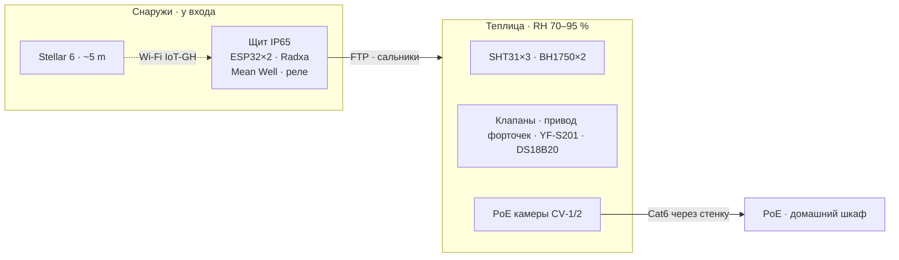
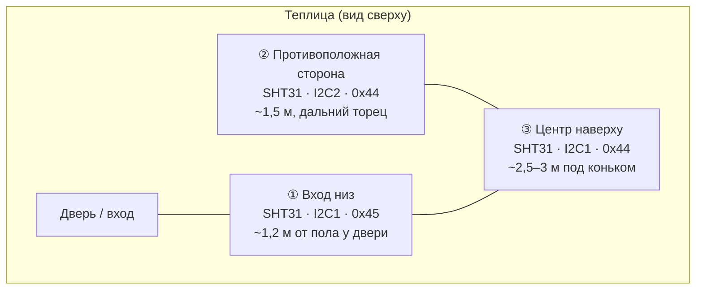
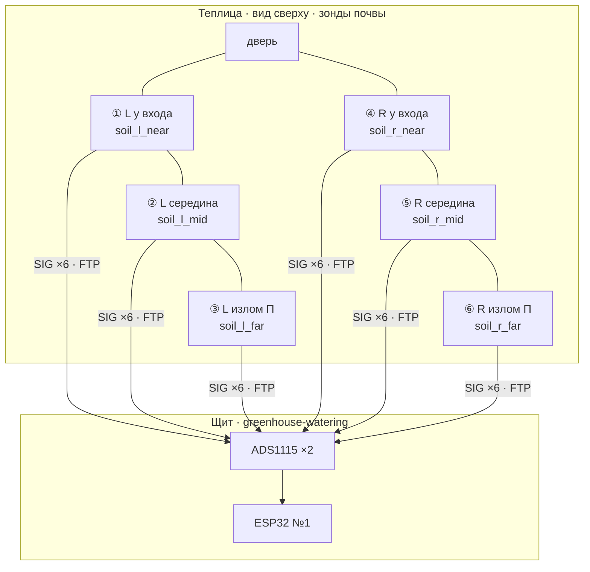
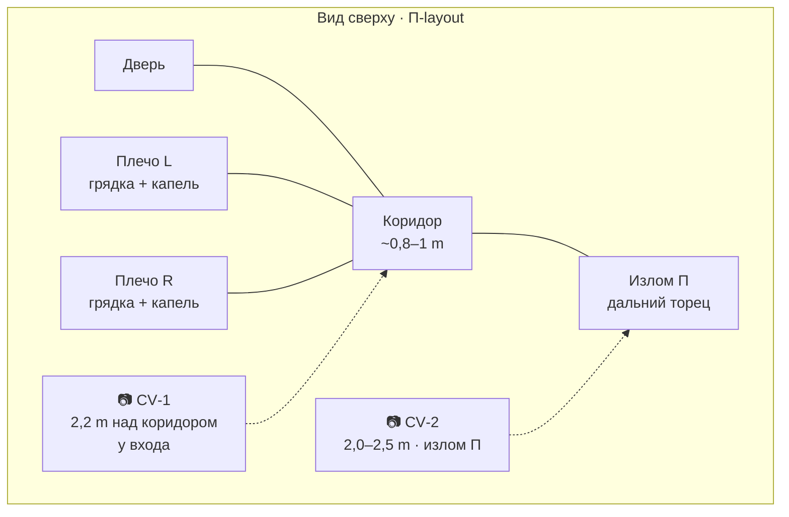

# Монтаж теплицы: компоненты и подключение

← [02-components-and-server](02-components-and-server.md) | [Оглавление](smart-greenhouse-design.md)
| [04-esp32-and-cabinet](04-esp32-and-cabinet.md) →

---

Физическое размещение датчиков и исполнительных устройств, гидравлическая разводка воды. Распиновка
ESP32 и сборка щита — [04-esp32-and-cabinet.md](04-esp32-and-cabinet.md).

## 0. Щит снаружи, датчики и камеры внутри

**Щит IP65** (ESP32 ×2, БП Mean Well, реле, PCA9685; опционально Radxa ZERO 3W для CV) монтируется
**снаружи теплицы у входной двери** на **сезон выращивания** (~май–сентябрь); **зимой снимается и
хранится в сухом помещении** ([§0.1](#01-сезонная-эксплуатация-монтаж-и-демонтаж-щита)). Не
размещается внутри влажного объёма. **Внутри** теплицы — датчики (SHT31/AHT20, BH1750, DS18B20,
контактные уровни бака, YF‑S201), исполнительные устройства (соленоидные клапаны, привод форточек,
концевики) и PoE‑камеры CV. Типичная **RH воздуха в теплице — 70–95 %** (летом и после полива ближе
к верхней границе); щит остаётся в более сухой зоне снаружи, но у влажного притока у двери — см.
антиконденсат в [04
§1.3](04-esp32-and-cabinet.md#13-щит-ip65-снаружи-у-входа--контроллеры-и-питание).

**Кабели от щита в теплицу:** **FTP Cat5e** (I2C, OneWire, GPIO, питание 5/12 V на нагрузки) через
**сальники PG7/PG9/PG11** с **drip loop**; **Cat6** — PoE‑камеры (ввод через раму/стенку у двери,
далее по периметру к домашнему PoE‑коммутатору, см. [05 §3.5](05-computer-vision.md#35-сеть-и-ip)).



ASCII (для монтажа на объекте):

```
                    [Stellar 6 · Mesh ~5 m]
                           │
  ┌─ FTP (датчики, клапаны, серво) ──────────────────────►  [внутри · RH 70–95 %]
  │                                                          SHT31/AHT20 · BH1750 · клапаны · актуаторы
  ▼
[Щит IP65 · СНАРУЖИ у двери]          [Cat6 PoE] ◄── камеры внутри ──► дом · PoE-коммутатор
 ESP32×2 + Radxa + БП
```

Сборка щита, Gore vent, силика‑гель, ориентация корпуса — [04
§1.3](04-esp32-and-cabinet.md#13-щит-ip65-снаружи-у-входа--контроллеры-и-питание), [04
§2.1](04-esp32-and-cabinet.md#21-общие-правила-монтажа-в-щите-ip65).

### 0.1. Сезонная эксплуатация: монтаж и демонтаж щита

Щит IP65 **не остаётся на объекте круглый год**. Модель эксплуатации для **центральной России**:

| Период | Щит | Автоматизация | Примечание |
|--------|-----|---------------|------------|
| **Сезон выращивания** (~**май–сентябрь**) | Смонтирован **снаружи у входа**, **220 V включён** | ESP32 ×2 (+ опц. Radxa) в сети; HA управляет поливом и форточками | Stellar 6 и домашний HA работают как обычно |
| **Зима** (~**октябрь–апрель**) | **Питание отключено**, щит **снят с крепления**, хранение **в сухом помещении** | Нет связи с ESP32; сущности HA — **unavailable**; автоматизации не выполняют действия | Ручной полив/краны на объекте при необходимости |

**Последствия зимнего демонтажа:**

- Полевые датчики и исполнительные устройства **остаются в теплице**, но **без питания и
  управления** с щита. Home Assistant (Pi 5 дома) может показывать **offline / unavailable** для
  `greenhouse_*` — это ожидаемо, не ошибка конфигурации. Опциональный **edge SBC для CV** хранится
  **вместе со щитом** (см. [05 §3.4](05-computer-vision.md#34-edge-sbc-в-щите-ip65)). PoE‑камеры:
  **на выбор** — оставить в теплице без питания или снять на зиму ([05 — сезон
  CV](05-computer-vision.md#014-сезонная-эксплуатация-cv)).

#### Демонтаж (конец сезона, ~сентябрь–октябрь)

1. В HA: убедиться, что клапаны закрыты, форточки закрыты (последний штатный цикл или ручное
   управление).
2. **Отключить 220 V** на линии щита (автомат/УЗО).
3. **Промаркировать** каждый **FTP‑хвост** на стороне теплицы (клеммная коробка / сальник): `SHT/AHT
   вход`, `SHT центр`, `BH1750`, `клапан полив`, `клапан бак`, `actuator/servo 1/2`, `YF‑201`,
   `DS18B20` и т.д. — по фактической разводке.
4. Разобрать жгулы в щите: WAGO/клеммы — **фото схемы** или этикетки «щит ↔ поле» для весенней
   сборки.
5. Отсоединить FTP от клемм щита; **не тянуть** кабель из теплицы — хвосты остаются с **drip loop**
   у сальников.
6. На **тепличной стороне** каждого сальника: **заглушки IP68** (blanking plug PG7/PG9/PG11) или
   мёртвые сальники с **герметиком**; нижняя точка петли кабеля — **ниже** отверстия сальника.
7. Снять щит с крепления; упаковать с **силика‑гелем** в сухую коробку/кладовую ([04 — чек‑лист
   хранения](04-esp32-and-cabinet.md#134-зимнее-хранение-щита-демонтаж)).
8. Опц.: отключить PoE‑порты камер на коммутаторе или снять камеры
   ([05](05-computer-vision.md#014-сезонная-эксплуатация-cv)).

#### Монтаж (начало сезона, ~апрель–май)

1. Осмотр FTP‑хвостов и сальников на теплице: нет ли грызунов/влаги, целостность заглушек.
2. Снять заглушки; проверить **drip loop** перед вводом.
3. Установить щит на штатное место; подключить FTP по маркировке; затянуть сальники.
4. Включить 220 V; дождаться загрузки ESP32; проверить ping / ESPHome / RSSI ([01
   §5.1](01-overview.md#51-чек-лист-после-сборки)).
5. Прогон автоматизаций в режиме трассировки; при необходимости — повторное применение профиля
   культуры.
6. Включить PoE камер и edge SBC, если используется CV.

Подробный чек‑лист содержимого щита при хранении — [04
§1.3.4](04-esp32-and-cabinet.md#134-зимнее-хранение-щита-демонтаж); регламент в HA — [01
§5.4](01-overview.md#54-сезонная-эксплуатация).

---

## 1. Подбор компонентов (теплица)
### 1.4. Датчики


*Датчики ★: SHT31 ×3 (или AHT20/AHT21 для бюджета), BH1750 ×2, DS18B20 waterproof ×2, **ёмкостная
влажность почвы IP68 ×6**, ADS1115 ×2, контактные уровни бака (3 болта), YF‑S201 ×2.*


| Датчик | Бюджет | Сбалансированный ★ | Премиум | Поиск |
|--------|--------|-------------------|---------|-------|
| T/H воздуха ×3 | **AHT20/AHT21** в вентилируемом экране | **SHT31 (GY‑SHT31‑D)** | SHT35 + фильтр PTFE | `SHT31 GY-SHT31 I2C` — [youbot.ru](https://www.youbot.ru/product/tsifrovoy-datchik-temperatury-i-vlazhnosti-gy-sht31d) · `AHT20 I2C датчик влажности` |
| Освещённость ×2 | BH1750 GY‑302 | **BH1750 GY‑302** (ADDR 0x23/0x5C) | VEML7700 (альтернатива) | `BH1750 GY-302 модуль` |
| T воды ×2 | DS18B20 в гильзе | **DS18B20 waterproof 1 м** | DS18B20 3 м + термопаста | `DS18B20 водонепроницаемый` |
| Уровень воды | Поплавковые датчики LOW/HIGH | **3 контактных болта: верх / средний / нижний общий + механический поплавковый клапан** | Поплавковые датчики + пассивный перелив | `болт нержавеющий M4 клемма кольцевая` · `поплавковый клапан бак 1/2` |
| Поток ×2 | YF‑S201 | **YF‑S201 1/2"** | YF‑B5 (больше диапазон) | `YF-S201 датчик расхода` — [iArduino](https://iarduino.ru/shop/Sensory-Datchiki/datchik-rashoda-vody-1-2-dyuyma.html) |
| Влажность почвы ×6 | Capacitive Soil Moisture v1.2/v2.0 + герметизация + запас 2 шт. | **Герметичный ёмкостный аналоговый зонд IP68 (класс Vegetronix VH400)** | RS485 industrial (JXBS‑3001) | `Capacitive Soil Moisture v1.2` · `Vegetronix VH400` · `ёмкостный датчик влажности почвы IP68 аналоговый` |
| АЦП почвы | — | **ADS1115 16‑bit I²C ×2** (ADDR 0x48 / 0x49) | ADS1015 | `ADS1115 модуль I2C` — [youbot.ru](https://www.youbot.ru/search?q=ADS1115) |

| Датчик | Кол-во | Цена ★, ₽ | Сумма, ₽ |
|--------|--------|-----------|----------|
| SHT31 | 3 | 300–450 | 1 050 |
| BH1750 | 2 | 150–250 | 400 |
| DS18B20 waterproof | 2 | 150–250 | 400 |
| Ёмкостный зонд почвы IP68 (VH400 class) | 6 | 850–1 200 | 5 400 |
| ADS1115 I²C ADC | 2 | 180–280 | 440 |
| Контактные уровни бака (болты + клеммы) | 1 компл. | 100–300 | 200 |
| YF‑S201 | 2 | 400–550 | 900 |
| **Итого датчики** | | | **~8 790** |

**Бюджетная замена почвенных зондов:** если VH400‑class/IP68 не помещается в бюджет, допустимы
**ёмкостные платы v1.2/v2.0**: 6 рабочих + 2 запасных, обязательная герметизация верхней электроники
эпоксидкой/лак+термоусадка, питание только на время измерения при следующей ревизии платы,
индивидуальная dry/wet‑калибровка каждого экземпляра. Не использовать резистивные YL‑69/FC‑28 в
постоянной установке: электролиз и коррозия быстро превращают показания в шум.

#### 1.4.1. Размещение SHT31 ×3 (триангуляция климата)

Три датчика SHT31 дают картину **в разных точках объёма** теплицы (типичный размер 3×4 … 3×6 m; **RH
70–95 %** — норма для неотапливаемой hobby‑теплицы). Вход — со стороны двери/форточек;
«противоположная сторона» — дальний торец. Центр наверху — под потолком/коньком, рядом с BH1750
«потолок». Кабели SHT/BH1750 уходят **наружу к щиту** (§0), не к отдельному блоку внутри теплицы.



ASCII (для монтажа на объекте):

```
                    [③ центр наверху · 0x44 · шина I2C1]
                              │
    [дверь] ── [① вход низ · 0x45 · I2C1] ─────────── [② противоположная · 0x44 · I2C2]
         ↑                              ↑                        ↑
      вход теплицы              у пола у входа            дальний торец, ~1,5 м
```

| Зона | Высота | I²C‑шина | ADDR | ESPHome ID | Назначение |
|------|--------|----------|------|------------|------------|
| Вход, низ | ~1,2 м у двери | I2C1 GPIO21/22 | 0x45 (ADDR→3.3 V) | `temp_entrance_low` | Холодный приток у пола, локальная влажность у входа |
| Противоположная сторона | ~1,5 м, дальний торец | I2C2 GPIO18/19 | 0x44 (ADDR→GND) | `temp_opposite` | Контраст с входом, «дальняя» зона |
| Центр, наверху | ~2,5–3 м под коньком | I2C1 GPIO21/22 | 0x44 (ADDR→GND) | `temp_center_top` | Перегрев под крышей, стратификация |

**Монтаж:** корпус SHT31 вдали от прямого солнеца и капель конденсата; кабель FTP (SDA/SCL/5 V/GND)
**из теплицы наружу в щит** у входа (§0). На каждой шине I2C — **разные** адреса 0x44 и 0x45
(перемычка ADDR на модуле GY‑SHT31‑D).

**Триангуляция в ESPHome** (`greenhouse-climate.yaml`): средние T/RH, min/max, разброс (Δ),
текстовые метки «горячей» и «холодной» зоны. Автоматизация проветривания в HA: **max T** по зонам
(перегрев где угодно) + **средняя влажность** (риск конденсата) — см.
[§4.5](01-overview.md#45-примеры-автоматизаций-home-assistant).

#### 1.4.3. Влажность почвы ×6 (П‑layout, ESP32 полива)

Шесть **герметичных ёмкостных** аналоговых зондов (класс **Vegetronix VH400** — эпоксидный корпус,
без exposed‑metal резистивных «гвоздей») равномерно покрывают оба плеча **П‑layout** грядок. Зонд в
**корневой зоне 10–15 см**, вдали от капельного эмиттера (≥15 cm), кабель **3‑wire** (5 V / GND /
SIG) по FTP в щит; **АЦП в щите** — два модуля **ADS1115** (I²C **0x48** / **0x49**) на ESP32 №1
GPIO21/22. Встроенный ADC ESP32 не используется (6 каналов, шум, Wi‑Fi). При бюджетных v1.2/v2.0
платах АЦП лучше переносить ближе к зондам или держать SIG коротким; длинный аналоговый хвост в
мокрой теплице даёт дрейф и наводки.



| Зона | Размещение на плече | ESPHome ID | ADS1115 |
|------|---------------------|------------|---------|
| L у входа | ~⅓ длины плеча от двери, 10–15 cm глубина | `soil_l_near` | 0x48 · A0 |
| L середина | середина плеча | `soil_l_mid` | 0x48 · A1 |
| L излом П | у дальнего торца (излом П) | `soil_l_far` | 0x48 · A2 |
| R у входа | ~⅓ от двери, зеркально L | `soil_r_near` | 0x48 · A3 |
| R середина | середина плеча | `soil_r_mid` | 0x49 · A0 |
| R излом П | излом П | `soil_r_far` | 0x49 · A1 |

**Сезон в мокрой почве:** только **ёмкостные герметичные** зонды; резистивные модули корродируют за
2–4 недели при RH почвы 70–95 %. После монтажа — **покалибровать каждый зонд** «сухо/мокро» для
вашего субстрата: в HA выберите зону в `input_select.greenhouse_soil_cal_probe`, нажмите **«Теплица
— калибровка зонда почвы (старт)»**, следуйте уведомлениям (сухая опора → подтверждение → влажная
опора → подтверждение). Скрипт `script.greenhouse_soil_moisture_calibrate` записывает напряжения в
`number.greenhouse_watering_pochva_*_kalib_sukho` / `_kalib_mokro` на ESP32 (сохраняются при
перезагрузке). Стартовые значения — `soil_cal_dry_v` / `soil_cal_wet_v` в
`esphome/greenhouse-watering.yaml`. Полив в HA — по **минимуму** из 6 зон
(`sensor.greenhouse_watering_teplitsa_minimalnaya_vlazhnost_pochvy`). Диагностика на практике: раз в
неделю смотреть raw‑напряжения; зонд с постоянным 0 V, близким к питанию, невозможным скачком или
«залипшей» влажностью пометить fault и заменить из запаса.

#### 1.4.2. П‑образная планировка грядок и камеры CV

Грядки расположены **П‑образно от входа** (буква «П» / Latin «P»): от двери вглубь идёт
**центральный коридор** (~0,8–1,0 m), по обе стороны — **два плеча** с грядками и капельными
линиями. Типичная теплица 3×4 … 3×6 m; дальний **излом П** — торец, куда упирается коридор.



ASCII (для монтажа):

```
                    [излом П · ② SHT31 · 📷 CV‑2 смотрит к входу]
                    ┌─────────────────────────────┐
    [плечо L грядка]│                             │[плечо R грядка]
                    │         коридор             │
                    └──────────────┬──────────────┘
                                   │
                              [📷 CV‑1]
                              [дверь · ① SHT31]
```

| Элемент | Размещение | Назначение |
|---------|------------|------------|
| **Коридор** | По оси двери, ширина под проход и шланг | Доступ к излому П; не засаживается |
| **Плечо L / R** | По 0,6–0,9 m ширины грядки с каждой стороны | Огурцы/помидоры; капельная лента вдоль длины плеча |
| **CV‑1** | Над коридором у входа, ~2,2 m, наклон ~35° вдоль коридора | Обзор **ближних 2–3 m обоих плеч** в перспективе, форточка 1 |
| **CV‑2** | Излом П (дальний угол), ~2,5 m у конька или ~2,0 m на стойке, наклон ~30° **к входу** | **Дальние 40–50 %** каждого плеча — зона, сжатая в перспективе CV‑1 |

**Обоснование двух камер для П‑layout:** одна камера у входа не разрешает детали на дальнем изломе;
вторая на изломе закрывает blind spot обоих плеч. Третья камера (центр наверху) — только при
подтверждённом dead zone между плечами.

PoE, IP `.21`/`.22`, монтаж и облако — [05-computer-vision.md
§3](05-computer-vision.md#31-планировка-грядок-и-камеры-п‑образная).

---

### 1.5. Исполнительные устройства


*Исполнительные устройства ★: соленоид NC 12 В ×2 (латунь 1/2"), линейные актуаторы 12 В ×2 для
рабочих форточек; MG996R ×2 остаётся бюджетным/стендовым вариантом под текущую ESPHome‑схему.*


| Узел | Бюджет | Сбалансированный ★ | Премиум | Поиск |
|------|--------|-------------------|---------|-------|
| Клапан полива NC 12 В | Пластик 1/2" NC 12 V | **Латунь 1/2" NC 12 V** (Sanlixin SLP1DF12 или аналог) | Нержавейка 3/4" NC + фильтр | `соленоидный клапан 12V NC 1/2 латунь` |
| Клапан наполнения бака NC | То же | То же, второй экземпляр | С датчиком давления | |
| Привод форточек ×2 | MG996R (прототип / лёгкая створка) | **Линейный актуатор 12 V с концевиками, IP54/IP65, ход 100–300 mm** | Актуатор с позиционной обратной связью | `линейный актуатор 12V 100mm концевики IP65` |
| Реле / драйверы | 2‑кан. реле для клапанов | **Реле/Н‑мост под фактический привод + предохранитель на линию** | MOSFET/драйвер с TVS и контролем тока | `реле модуль 12V оптрон 2 канала` · `BTS7960 H bridge 12V` |

| Компонент | Кол-во | Цена ★, ₽ | Сумма, ₽ |
|--------|--------|-----------|----------|
| Соленоид NC 12 V 1/2" | 2 | 600–1 200 | 1 800 |
| Линейный актуатор 12 V с концевиками | 2 | 1 800–3 500 | 5 000 |
| MG996R (если оставлять текущую PCA9685‑схему) | 2 | 400–550 | 900 |
| Концевик NC (микропереключатель) | 4 | 50–150 | 400 |
| Реле 2‑кан (уже в щите) | — | — | — |
| **Итого actuators (с актуаторами)** | | | **~7 200** |

**Выбор привода форточек:** для реальной сезонной эксплуатации лучше линейный актуатор 12 V со
встроенными концевиками и запасом по усилию. **MG996R** допустим как дешёвый старт, стенд или очень
лёгкая заслонка; он чувствителен к влажности, постоянной нагрузке и механическому перекосу. Текущий
`esphome/greenhouse-climate.yaml` реализует именно MG996R через PCA9685; переход на линейные
актуаторы потребует Н‑моста/реле реверса, защиты 12 V и обновления ESPHome.

**Концевики форточек (×4):** по одному NC‑микропереключателю на каждое крайнее положение каждой
форточки (закрыто / открыто), если у актуатора нет независимого вывода положения. Монтаж —
[§2.4](04-esp32-and-cabinet.md#24-подключение-привода-форточек-и-концевиков) в
[04-esp32-and-cabinet.md](04-esp32-and-cabinet.md). Логика проверки —
`esphome/greenhouse-climate.yaml`; уведомление HA — `greenhouse_vent_position_fault_alert`.

---

## 2. Гидравлика и водоснабжение
### 2.6. Гидравлическая схема водоснабжения и полива

Система разделена на **две независимые линии** с общим источником воды (ручной кран / водопровод у
теплицы). Каждая линия имеет свой соленоидный клапан NC 12 В
([§1.5](03-greenhouse-installation.md#15-исполнительные-устройства)) и свой расходомер YF‑S201 1/2"
([§1.4](03-greenhouse-installation.md#14-датчики)). Управление — ESP32 №1 `greenhouse-watering`
([§2.2](04-esp32-and-cabinet.md#22-распиновка-esp32-1--полив-и-бак-greenhouse-watering),
[§4.2](04-esp32-and-cabinet.md#42-esphome--esp32-1-полив-и-бак)); логика объёма и аварии «нет
потока» — в прошивке ESPHome и автоматизациях HA
([§4.5](01-overview.md#45-примеры-автоматизаций-home-assistant),
`homeassistant/automations/greenhouse.yaml`).

#### 2.6.1. Схема «откуда → куда» (физическая)

Направление потока — слева направо. При обесточивании оба клапана **закрыты** (NC, fail‑safe). Для
линии наполнения бака нужен **независимый механический барьер**: поплавковый клапан в баке или
отдельный аппаратный cutoff, который перекрывает воду без участия ESP32/Home Assistant.


ASCII (для печати / быстрой сверки на объекте):

```
[Кран] ──► [Клапан бака GPIO27] ──► [YF-S201 GPIO14] ──► [Поплавковый клапан] ──► [Бак + уровни + DS18B20]
                                                              │
                                                              ▼
                                         [Капельные линии ◄── [YF-S201 GPIO13] ◄── [Клапан полива GPIO26]
```

**Монтажные правила:**

1. **Последовательность на каждой линии:** клапан → расходомер → потребитель (бак или капельная
   система). Расходомер стоит **после** клапана, чтобы при закрытом клапане не было ложных
   импульсов.
2. **Резьба 1/2"** на клапанах и YF‑S201 — переход на капельную магистраль 16 мм через штуцер 1/2" →
   16 мм и, при необходимости, короткий участок ПНД‑трубы 16 мм (§2.6.4).
3. **Фильтр** (сетка ≥120 mesh) рекомендуется на линии наполнения (до YF‑S201) и перед капельной
   линией — защита эмиттеров от взвеси.
4. **Независимый stop‑layer для бака:** механический поплавковый клапан ставится на вводе в бак
   после расходомера наполнения. Он выставляется чуть выше электрического верхнего контакта, но ниже
   перелива/кромки бака. Это не замена датчикам уровня и HA‑аварии, а второй физический барьер на
   случай залипания реле/клапана, ошибки прошивки, зависания HA или ложного контакта уровня.
5. **Перелив:** если бак закрытый или стоит рядом с электрикой, добавить пассивный перелив/дренаж в
   безопасную сторону. Перелив должен принять поток водопровода даже при полностью открытом клапане
   наполнения.
6. **Линии не параллелить:** наполнение и полив не должны быть открыты одновременно на одном участке
   трубы без разделения — в проекте они разведены последовательно через бак.
7. **Давление:** YF‑S201 работает от ~1 л/мин; капельная лента Neo‑Drip / аналог — 0,8–1,2 bar. Бак
   выше уровня грядок на 0,5–1 м обычно даёт достаточный напор; при слабом потоке — поднять бак или
   добавить маломощный насос **после** клапана полива (вне NC‑контура ESP32).

#### 2.6.2. Состав линий

**Линия наполнения бака** (вода с крана → бак):

| № | Компонент | GPIO / ID | Назначение |
|---|-----------|-----------|------------|
| 1 | Ручной кран | — | Подача воды; закрывать на зиму |
| 2 | Соленоид NC 12 V 1/2" | GPIO27 → `valve_tank_fill` | Открытие только при автоматическом/ручном наполнении |
| 3 | YF‑S201 1/2" | GPIO14 → `flow_tank_fill` | Учёт залитого объёма; контроль «нет потока» |
| 4 | Механический поплавковый клапан / cutoff | — | Независимо перекрывает ввод в бак без ESP32/HA |
| 5 | Бак | GPIO16 → `tank_level_upper`, GPIO17 → `tank_level_middle`, нижний контакт → GND | Накопитель; гистерезис между средним и верхним уровнями |
| 6 | DS18B20 waterproof | GPIO4 (OneWire) | Температура воды в баке |

**Линия полива** (вода из бака → растения):

| № | Компонент | GPIO / ID | Назначение |
|---|-----------|-----------|------------|
| 1 | Бак | — | Источник по гравитации или через насос |
| 2 | Соленоид NC 12 V 1/2" | GPIO26 → `valve_irrigation` | Дозированный полив по объёму или времени |
| 3 | YF‑S201 1/2" | GPIO13 → `flow_irrigation` | Учёт полива; контроль «нет потока» |
| 4 | Переход 1/2" → 16 мм + фильтр | — | Соединение с капельной системой (§2.6.4) |
| 5 | Капельная лента / трубка 16 мм | — | Разводка по грядкам |
| 6 | DS18B20 waterproof | GPIO4 (OneWire) | Температура на линии полива (второй зонд) |

#### 2.6.3. Контроль потока и учёт объёма

Логика реализована в `esphome/greenhouse-watering.yaml` (глобальные параметры `no_flow_timeout_ms:
15000`, `no_flow_threshold_lmin: 0.05`, `post_close_settle_ms: 8000`, `post_close_check_ms: 5000`,
`idle_flow_check_ms: 12000`, базовая калибровка `flow_multiplier: 0.00222` для YF‑S201).

**Контактные уровни бака:** в баке три болта: 1 — верхний уровень (`GPIO16`), 2 — средний уровень
(`GPIO17`), 3 — нижний общий (`GND`). Когда вода замыкает 1↔3 — бак полон; когда вода замыкает 2↔3 —
воды достаточно. Если 2↔3 разомкнуты, HA открывает клапан наполнения и держит его открытым до
замыкания 1↔3. Это создаёт гистерезис между средним и верхним уровнем, чтобы не доливать бак при
каждом небольшом расходе.

**Автокалибровка расходомера наполнения:** в HA задайте
`number.greenhouse_watering_bak_obem_mezhdu_urovnyami` — фактический объём воды между средним и
верхним контактами. Во время наполнения ESPHome начинает считать сырые импульсы YF‑S201, когда
замыкается средний контакт, и заканчивает при замыкании верхнего контакта. Новый коэффициент
`number.greenhouse_watering_bak_koeffitsient_raskhodomera_napolneniya` вычисляется как
`объём_между_уровнями / импульсы_между_уровнями` и сохраняется на ESP32.
`sensor.greenhouse_watering_bak_impulsy_posledney_kalibrovki` показывает, сколько импульсов было в
последней успешной калибровке.

| Событие | Условие (ESPHome) | Действие |
|---------|-------------------|----------|
| Старт цикла | Клапан включён | Запомнить `total_liters` на расходомере; обнулить флаг «поток виден»; сбросить аварию «поток при закрытом клапане» |
| Нормальный поток | Расход ≥ 0,05 л/мин | Флаг «поток виден»; импульсы → накопительный счётчик литров |
| **Авария «нет потока»** | Клапан открыт **15 с**, расход так и не достиг порога | `binary_sensor` «нет потока» → ON; HA закрывает клапан и шлёт уведомление |
| **Поток при закрытом клапане** (после закрытия) | Клапан закрыт **8 с** (установка), затем расход ≥ 0,05 л/мин непрерывно **5 с** | Тот же `binary_sensor` «поток при закрытом клапане» → ON |
| **Поток в простое** (idle) | Клапан линии закрыт (в т.ч. после загрузки ESP), расход ≥ 0,05 л/мин непрерывно **12 с** | Тот же `binary_sensor`; HA шлёт уведомление (утечка, открытый вручную кран, залипший клапан, неисправность датчика). Сброс при возврате расхода к ~0 или при открытии клапана |
| **Цель полива достигнута** | `объём_за_цикл` ≥ `number` целевой объём | `binary_sensor` «цель достигнута» → ON; автоматизация HA закрывает клапан полива |
| Наполнение бака | Средний уровень OFF → открыть клапан; верхний уровень ON **или** «нет потока» → закрыть клапан | Гистерезис между средним и верхним уровнем ([§4.5](01-overview.md#45-примеры-автоматизаций-home-assistant)) |
| Автокалибровка наполнения | Во время наполнения: средний уровень ON → верхний уровень ON, есть ≥10 импульсов | Обновить коэффициент расходомера наполнения на ESP32 |

**Сущности ESPHome → Home Assistant** (после прошивки; точный slug проверить в **Настройки →
Устройства**):

| Назначение | Тип | Пример `entity_id` |
|------------|-----|-------------------|
| Клапан полива | switch | `switch.greenhouse_watering_klapan_poliva` |
| Клапан наполнения | switch | `switch.greenhouse_watering_klapan_napolneniya_baka` |
| Расход полива | sensor | `sensor.greenhouse_watering_poliv_rashod` |
| Объём за цикл полива | sensor | `sensor.greenhouse_watering_poliv_obem_za_tsikl` |
| Целевой объём | number | `number.greenhouse_watering_poliv_tselevoy_obem` |
| Нет потока (полив) | binary_sensor | `binary_sensor.greenhouse_watering_poliv_net_potoka` |
| Нет потока (наполнение) | binary_sensor | `binary_sensor.greenhouse_watering_bak_net_potoka_napolneniya` |
| Поток при закрытом клапане (полив) | binary_sensor | `binary_sensor.greenhouse_watering_poliv_potok_pri_zakrytom_klapane` |
| Поток при закрытом клапане (наполнение) | binary_sensor | `binary_sensor.greenhouse_watering_bak_potok_pri_zakrytom_klapane` |
| Цель полива достигнута | binary_sensor | `binary_sensor.greenhouse_watering_poliv_tsel_dostignuta` |
| Верхний уровень бака | binary_sensor | `binary_sensor.greenhouse_watering_bak_verkhniy_uroven` |
| Средний уровень бака | binary_sensor | `binary_sensor.greenhouse_watering_bak_sredniy_uroven` |
| Объём наполнения за цикл | sensor | `sensor.greenhouse_watering_bak_obem_napolneniya_za_tsikl` |
| Объём между контактами | number | `number.greenhouse_watering_bak_obem_mezhdu_urovnyami` |
| Коэффициент расходомера наполнения | number | `number.greenhouse_watering_bak_koeffitsient_raskhodomera_napolneniya` |
| Импульсы последней калибровки | sensor | `sensor.greenhouse_watering_bak_impulsy_posledney_kalibrovki` |
| Влажность почвы ×6 (зональная) | sensor | `sensor.greenhouse_watering_pochva_*_vlazhnost` |
| Мин. / средняя влажность почвы | sensor | `sensor.greenhouse_watering_teplitsa_minimalnaya_vlazhnost_pochvy`, `..._srednyaya_vlazhnost_pochvy` |

**Автоматизации HA** (`homeassistant/automations/greenhouse.yaml`):

| ID | Назначение |
|----|------------|
| `greenhouse_apply_plant_profile` | Уставки полива/проветривания по профилю (огурцы / помидоры) |
| `greenhouse_irrigation_by_soil_moisture` | Полив до целевого объёма (утро, мин. влажность почвы ниже уставки, светло) |
| `greenhouse_tank_fill` | Наполнение от среднего до верхнего уровня с учётом расхода |
| `greenhouse_tank_overflow_protection` | Аварийное закрытие при переполнении |
| `greenhouse_watering_no_flow_alert` | Закрытие клапана и уведомление при «нет потока» |
| `greenhouse_watering_post_close_flow_alert` | Уведомление при неожиданном потоке на закрытой линии (после закрытия или в простое) |

Helpers: `input_select.greenhouse_plant_profile`, `input_number.greenhouse_*`
(`homeassistant/input_select.yaml`, `input_number.yaml`). Профили и уставки почвы — см.
[01-overview.md §4.6](01-overview.md#46-профили-культур-огурцы--помидоры).

#### 2.6.4. Капельная линия — рекомендации

Для небольшой теплицы (3×4 … 3×6 м) достаточно **магистрали 16 мм** и **1–2 рядов** капельной
ленты/трубки вдоль грядок. Соленоиды проекта — **1/2"**, капельный рынок — **16 мм**; нужны штуцер
**1/2" → 16 мм**, заглушки/краны линии, стяжки.

| Вариант | Когда выбирать | Параметры ★ | Цена ★, ₽ | Где купить |
|---------|----------------|-------------|-----------|------------|
| **Капельная лента эмиттерная** ★ | Односезонный / бюджетный полив рядовых культур (огурцы, томаты, зелень) | Ø **16 мм**, шаг **20 см**, вылив **1,6 л/ч**, стенка 6–8 mil, бухта **50–100 м** | **590–1 500** за 100 м | [Лемана ПРО (бывш. Леруа Мерлен)](https://lemanapro.ru/catalog/search?text=капельная+лента+16+мм+20+см+100) — искать «Лента капельная 100 м, шаг 20 см»; [polivnadache.ru — Neo-Drip P16, шаг 20, 50 м](https://polivnadache.ru/products/kapelnaya-lenta-emitternaya-neo-drip-shag-20-bukhta-50m) |
| **Капельная трубка BOUTTE** | Многосезонная, UV‑стойкая; шаг 33 см — для крупных кустов / реже посаженных рядов | Ø **16 мм**, шаг **33 см**, **2,2 л/ч**, длина **25–80 м** | **1 500–2 500** за 25 м | [Лемана ПРО — BOUTTE 16 мм, 25 м](https://lemanapro.ru/catalog/search?text=BOUTTE+капельная+трубка+16+мм+25) · [Ozon — поиск «BOUTTE капельная трубка 16 мм»](https://www.ozon.ru/search/?text=BOUTTE+капельная+трубка+16+мм+25+м) |

**Рекомендация ★:** для типовой домашней теплицы — **капельная лента 16 мм, шаг 20 см, 100 м**
(Neo‑Drip или аналог из Лемана ПРО). Одной бухты хватает на 2–4 ряда по 6–12 м; остаток — в запас.
Если нужна установка на несколько лет без замены — **BOUTTE 16 мм** (толстостенная трубка со
встроенными эмиттерами).

**Совместимость с клапанами 12 V NC:** капельная линия не требует электрической совместимости —
важны **диаметр 16 мм** и **рабочее давление** (0,8–1,2 bar для ленты). Соленоиды
[§1.5](03-greenhouse-installation.md#15-исполнительные-устройства) (латунь 1/2" NC 12 V) подходят;
минимальное давление открытия — проверить на стенде (обычно 0 bar для прямого действия).

Поисковые запросы для сверки цен:

```
капельная лента 16 мм шаг 20 см 100 м
BOUTTE капельная трубка 16 мм 25 м
штуцер 1/2 дюйма на капельную ленту 16 мм
фильтр капельный полив 120 mesh
```

---


---

← [02-components-and-server](02-components-and-server.md) | [Оглавление](smart-greenhouse-design.md)
| [04-esp32-and-cabinet](04-esp32-and-cabinet.md) →

---
