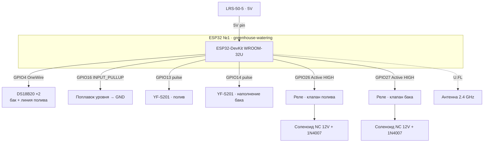
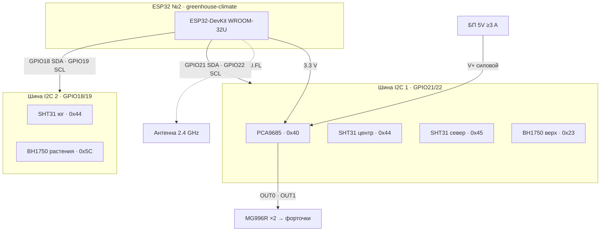
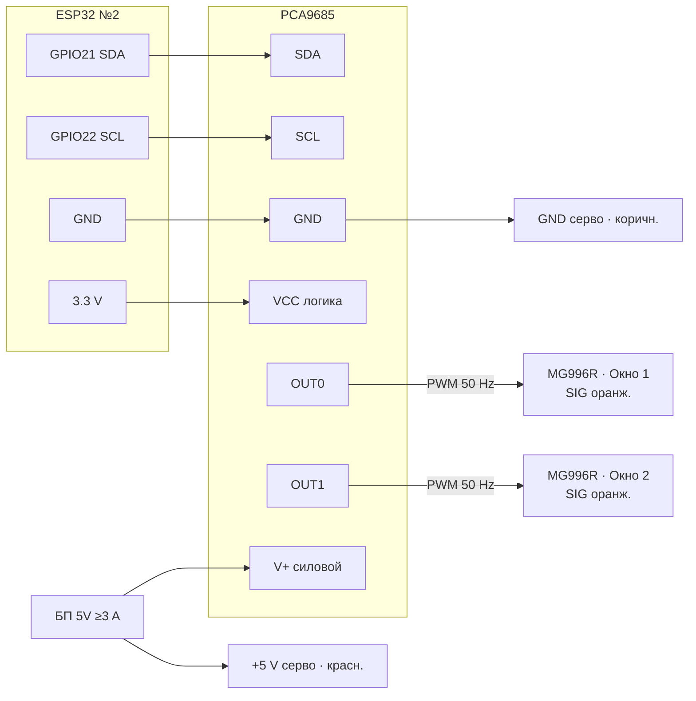
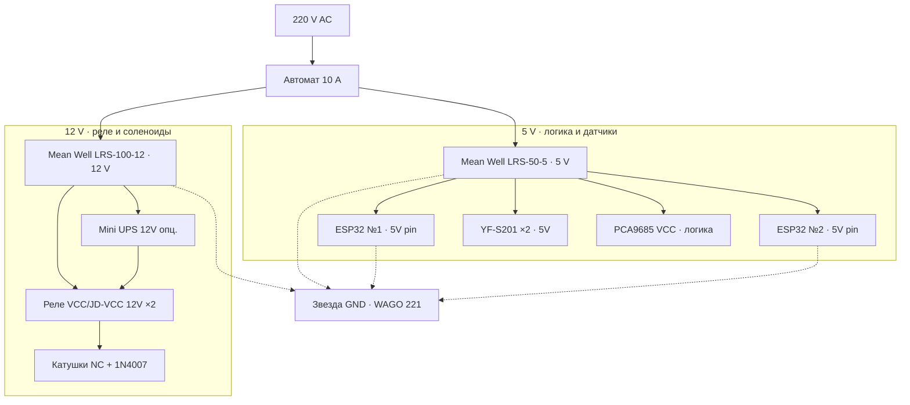
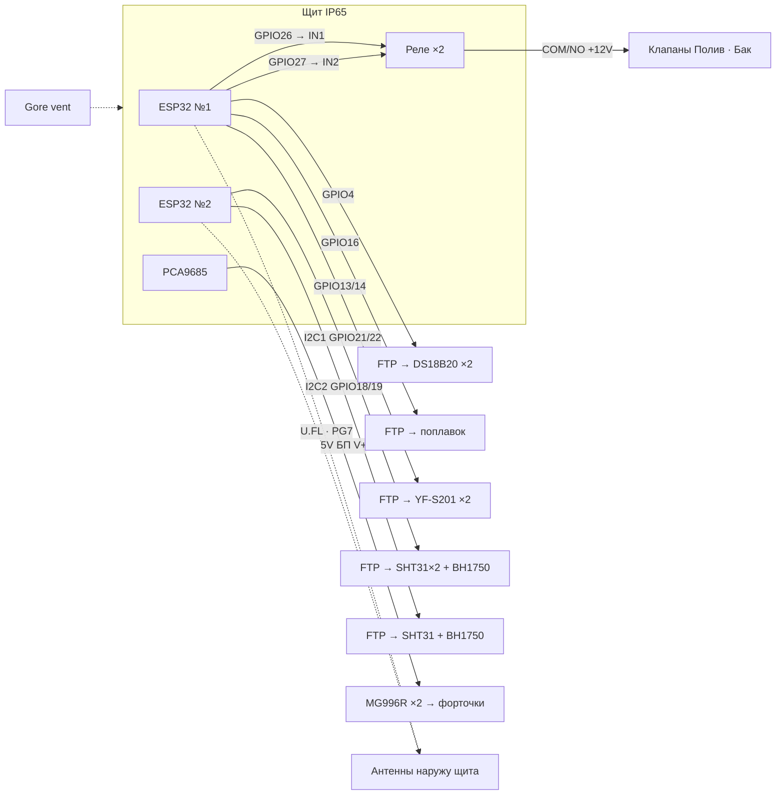

# Программирование ESP32 и сборка щита

← [03-greenhouse-installation](03-greenhouse-installation.md) | [Оглавление](smart-greenhouse-design.md)

---

Сборка щита IP65, GPIO, ESPHome и интеграция с Home Assistant. BOM щита — [§1.3](04-esp32-and-cabinet.md#13-щит-ip65-у-теплицы--контроллеры-и-питание) ниже; гидравлика — [§2.6](03-greenhouse-installation.md#26-гидравлическая-схема-водоснабжения-и-полива).

## 1. Подбор компонентов (щит)
### 1.3. Щит IP65 у теплицы — контроллеры и питание


*Щит IP65 ★: два ESP32‑WROOM‑32U, Mean Well LRS‑50‑5 / LRS‑100‑12, реле 12 В опто, PCA9685, диоды 1N4007, металлический щит DKC 300×400.*


| Узел | Бюджет | Сбалансированный ★ | Премиум | Поиск |
|------|--------|-------------------|---------|-------|
| ESP32 (2 шт.) | ESP32‑DevKitC на WROOM‑32 (PCB‑антенна) + внешняя антенна с переходником | **ESP32‑DevKitC на ESP32‑WROOM‑32U** (разъём U.FL/IPEX) | ESP32‑WROVER‑E 16 МБ + U.FL | `ESP32 WROOM 32U DevKit U.FL` |
| Внешняя антенна 2.4 ГГц | 2 dBi pigtail U.FL → SMA, 15 см | **5 dBi omnii, кабель 50 см**, IP65 | 8 dBi направленная на AP | `WiFi антенна 2.4GHz U.FL pigtail` |
| БП 5 В логика | Mean Well RS‑15‑5 (15 Вт) | **Mean Well LRS‑50‑5** (50 Вт, 10 А) | Дублирующий БП + ORing | `Mean Well LRS-50-5` |
| БП 12 В силовой | 12 В 3 А блок | **Mean Well LRS‑100‑12** (8.5 А) | 12 В 10 А + ИБП 12 В | `Mean Well LRS-100-12` |
| ИБП 12 В (опц.) | — | **Mini UPS 12 В 3 А** на клапаны/реле | ИБП 12 В 60 Вт | `ИБП 12V DC mini UPS` |
| Щит IP65 | Пластик 300×400×200 IP65 | **DKC R5ST0342 300×400×200** металл IP65 | 400×500×250 + клапан Gore | `щит IP65 300x400 DKC` |
| DIN‑рейка + клеммы | Клеммники винтовые | **WAGO 221‑412/413** (набор) | WAGO + маркировка | `WAGO 221 набор` |
| Сальники | PG7/PG9 пластик | **PG7/PG9 + PG11**, IP68 латунь | Многоразовые EMC‑вводы | `сальник PG9 IP68` |
| Кабель сигнальный | UTP Cat5e outdoor | **FTP Cat5e экранированный** наружный | SFTP + гофра UV | `FTP Cat5e 4 пары наружный` |
| Клапан выравнивания | — | **Gore vent IP67** на щит | — | `Gore vent IP67 электрощит` |

| Компонент | Кол-во | Цена ★, ₽ | Сумма, ₽ |
|-----------|--------|-----------|----------|
| ESP32‑WROOM‑32U DevKit | 2 | 800–1 200 | 2 000 |
| Антенна 5 dBi + pigtail | 2 | 350–600 | 900 |
| Mean Well LRS‑50‑5 | 1 | 1 800–2 400 | 2 100 |
| Mean Well LRS‑100‑12 | 1 | 2 500–3 200 | 2 850 |
| Реле 12 В опто (2‑кан.) | 2 | 250–450 | 700 |
| PCA9685 16‑канальный | 1 | 600–700 | 650 |
| Диоды 1N4007 (уже в наличии) | 4 | 0 | 0 |
| Щит DKC 300×400 IP65 | 1 | 4 500–6 500 | 5 500 |
| WAGO 221, сальники, DIN | 1 компл. | — | 2 500 |
| FTP‑кабель 50 м | 1 | 2 000–3 500 | 2 800 |
| **Итого щит (без датчиков/актуаторов)** | | | **~20 000** |

---

## 2. Схема подключения
### 2.1. Общие правила монтажа в щите IP65

1. **Разделение питания:** БП 5 В (ESP32, датчики, PCA9685 логика) и БП 12 В (реле, соленоиды) — отдельные Mean Well; общая только «земля» (GND) в одной точке (звезда).
2. **NC‑клапаны:** без питания на катушке — закрыты. Реле **выключено** → клапан закрыт. При пропадании питания ESP32 реле разомкнуты → вода перекрыта.
3. **Flyback:** диод **1N4007** параллельно каждой катушке (реле/сolenoid): катод к «+» 12 В, анод к выходу реле.

   
4. **I2C:** короткие линии в щите; для выноса SHT/BH1750 в теплицу — FTP, SDA/SCL + 5 V + GND, экран на GND в одной точке у ESP32.
5. **OneWire (DS18B20):** экранированная пара, подтяжка 4.7 кΩ к 3.3 V на ESP32.
6. **Поплавок:** NO — замыкание на GND при высоком уровне (или NC — инверсия в ESPHome).

---

### 2.2. Распиновка ESP32 №1 — «Полив и бак» (`greenhouse-watering`)



| GPIO | Назначение | Подключение | Примечание |
|------|------------|-------------|------------|
| — | Питание | USB или 5 V на 5V/VIN | От LRS‑50‑5 |
| GPIO4 | OneWire | DS18B20 #1, #2 (бак + линия полива) | Подтяжка 4.7 kΩ |
| GPIO16 | Цифровой вход | Поплавок уровня → GND | `INPUT_PULLUP`, инверсия при NO |
| GPIO13 | Pulse counter | YF‑S201 «полив» (сигнал) | 5 V питание датчика от 5 V БП |
| GPIO14 | Pulse counter | YF‑S201 «наполнение бака» | |
| GPIO26 | Выход реле | IN канал 1 → реле «клапан полива» | Active HIGH |
| GPIO27 | Выход реле | IN канал 2 → реле «клапан наполнения бака» | Active HIGH |
| GPIO21/22 | *Резерв I2C* | Не используются | |
| U.FL | Wi‑Fi | Внешняя антенна 2.4 ГГц | Вынести разъём за металл щита |

**Не использовать:** GPIO6–11 (flash), GPIO34–39 (только вход, без pull-up).

---

### 2.3. Распиновка ESP32 №2 — «Климат и окна» (`greenhouse-climate`)



| GPIO | Назначение | Подключение | I2C‑адрес |
|------|------------|-------------|-----------|
| GPIO21 | I2C SDA | Шина 1: SHT31×2, BH1750 #1, PCA9685 | — |
| GPIO22 | I2C SCL | Шина 1 | — |
| GPIO18 | I2C SDA | Шина 2: SHT31 #3, BH1750 #2 | — |
| GPIO19 | I2C SCL | Шина 2 | — |
| — | PCA9685 V+ | Отдельные 5 V 3 A на сервоприводы | Не от USB ESP32 |
| U.FL | Wi‑Fi | Внешняя антенна | |

**I2C‑устройства на шине 1 (GPIO21/22):**

| Устройство | ADDR | Зона |
|------------|------|------|
| SHT31 «центр» | 0x44 (ADDR→GND) | Центр теплицы |
| SHT31 «север» | 0x45 (ADDR→3.3 V) | Северная сторона |
| BH1750 «верх» | 0x23 | Под потолком |
| PCA9685 | 0x40 | Драйвер серво |

**Шина 2 (GPIO18/19):**

| Устройство | ADDR | Зона |
|------------|------|------|
| SHT31 «юг» | 0x44 | Южная сторона |
| BH1750 «рабочая зона» | 0x5C (ADDR→3.3 V) | Уровень растений |

---

### 2.4. Подключение PCA9685 и сервоприводов MG996R



- Частота PWM для серво в ESPHome: **50 Hz**.
- При двух MG996R под нагрузкой обязателен **отдельный БП 5 V ≥ 3 A** на клемму V+ PCA9685.
- Механика: серво → рычаг → форточка; установить **концевые упоры** и калибровать угол в HA (0° = закрыто, 90° = приоткрыто).

---

### 2.5. Схема «откуда → куда» (щит IP65)

**Распределение питания** (5 V логика и 12 V нагрузки — отдельные БП, общая звезда GND):



**Сигнальные и силовые связи щита** (FTP — вынос в теплицу):



> Электрическая часть ESP32 №1 — [§2.2](04-esp32-and-cabinet.md#22-распиновка-esp32-1--полив-и-бак-greenhouse-watering). **Гидравлическая разводка** (кран → бак → капельный полив) — [§2.6](03-greenhouse-installation.md#26-гидравлическая-схема-водоснабжения-и-полива).

---

## 4. Прошивка и интеграция
### 4.1. Подготовка ESPHome

1. Home Assistant → **Настройки** → **Устройства и службы** → **Добавить интеграцию** → **ESPHome**.
2. Установить add-on **ESPHome** (если ещё нет).
3. Прошивка: USB первичная → далее OTA по Wi‑Fi.

Файлы конфигурации рекомендуется хранить в репозитории:

```
smart-greenhouse/
  esphome/
    greenhouse-watering.yaml
    greenhouse-climate.yaml
```

---

### 4.2. ESPHome — ESP32 №1 «Полив и бак»

```yaml
esphome:
  name: greenhouse-watering
  friendly_name: "Теплица — полив и бак"
  name_add_mac_suffix: false

esp32:
  board: esp32dev
  framework:
    type: arduino

logger:
  level: INFO

api:
  encryption:
    key: !secret api_encryption_key

ota:
  - platform: esphome
    password: !secret ota_password

wifi:
  ssid: !secret wifi_ssid_iot
  password: !secret wifi_password_iot
  fast_connect: true
  power_save_mode: none
  manual_ip:
    static_ip: 192.168.30.11
    gateway: 192.168.30.1
    subnet: 255.255.255.0
  # После первого подключения раскомментируйте BSSID ближайшей Mesh-точки:
  # bssid: "XX:XX:XX:XX:XX:XX"
  ap:
    ssid: "Greenhouse-Water Fallback"
    password: !secret ap_fallback_password

captive_portal:

sensor:
  - platform: wifi_signal
    name: "Полив — RSSI"
    id: wifi_rssi
    update_interval: 60s

  - platform: dallas_temp
    one_wire_id: bus_onewire
    name: "Бак — температура воды"
    id: tank_water_temp
    filters:
      - sliding_window_moving_average:
          window_size: 5
          send_every: 5

  - platform: dallas_temp
    one_wire_id: bus_onewire
    address: 0x000000000000  # заменить на реальный ROM после первого скана
    name: "Полив — температура воды"
    id: irrigation_water_temp

  - platform: pulse_counter
    pin:
      number: GPIO13
      mode: INPUT_PULLUP
    name: "Полив — расход"
    id: flow_irrigation
    unit_of_measurement: "L/min"
    accuracy_decimals: 2
    filters:
      - multiply: 0.00222  # YF-S201: ~450 имп/л → L/min (калибровать!)
    update_interval: 1s

  - platform: pulse_counter
    pin:
      number: GPIO14
      mode: INPUT_PULLUP
    name: "Бак — расход наполнения"
    id: flow_tank_fill
    unit_of_measurement: "L/min"
    accuracy_decimals: 2
    filters:
      - multiply: 0.00222
    update_interval: 1s

binary_sensor:
  - platform: gpio
    pin:
      number: GPIO16
      mode: INPUT_PULLUP
      inverted: true
    name: "Бак — высокий уровень"
    id: tank_level_high
    device_class: moisture

switch:
  - platform: gpio
    pin: GPIO26
    name: "Клапан полива"
    id: valve_irrigation
    restore_mode: ALWAYS_OFF
    icon: "mdi:sprinkler"

  - platform: gpio
    pin: GPIO27
    name: "Клапан наполнения бака"
    id: valve_tank_fill
    restore_mode: ALWAYS_OFF
    icon: "mdi:water-pump"

one_wire:
  - platform: gpio
    pin: GPIO4
    id: bus_onewire

interval:
  - interval: 5min
    then:
      - if:
          condition:
            lambda: 'return id(wifi_rssi).state < -85;'
          then:
            - logger.log: "RSSI низкий, перезагрузка Wi-Fi"
            - wifi.disable:
            - delay: 5s
            - wifi.enable:
```

---

### 4.3. ESPHome — ESP32 №2 «Климат и окна»

```yaml
esphome:
  name: greenhouse-climate
  friendly_name: "Теплица — климат и окна"
  name_add_mac_suffix: false

esp32:
  board: esp32dev
  framework:
    type: arduino

logger:
  level: INFO

api:
  encryption:
    key: !secret api_encryption_key

ota:
  - platform: esphome
    password: !secret ota_password

wifi:
  ssid: !secret wifi_ssid_iot
  password: !secret wifi_password_iot
  fast_connect: true
  power_save_mode: none
  manual_ip:
    static_ip: 192.168.30.12
    gateway: 192.168.30.1
    subnet: 255.255.255.0
  ap:
    ssid: "Greenhouse-Climate Fallback"
    password: !secret ap_fallback_password

captive_portal:

i2c:
  - id: bus_main
    sda: GPIO21
    scl: GPIO22
    scan: true
  - id: bus_secondary
    sda: GPIO18
    scl: GPIO19
    scan: true

sensor:
  - platform: wifi_signal
    name: "Климат — RSSI"
    id: wifi_rssi
    update_interval: 60s

  - platform: sht3xd
    i2c_id: bus_main
    address: 0x44
    update_interval: 30s
    temperature:
      name: "Теплица центр — температура"
      id: temp_center
    humidity:
      name: "Теплица центр — влажность"
      id: hum_center

  - platform: sht3xd
    i2c_id: bus_main
    address: 0x45
    temperature:
      name: "Теплица север — температура"
      id: temp_north
    humidity:
      name: "Теплица север — влажность"
      id: hum_north

  - platform: sht3xd
    i2c_id: bus_secondary
    address: 0x44
    temperature:
      name: "Теплица юг — температура"
      id: temp_south
    humidity:
      name: "Теплица юг — влажность"
      id: hum_south

  - platform: bh1750
    i2c_id: bus_main
    address: 0x23
    name: "Освещённость потолок"
    id: lux_ceiling
    update_interval: 60s

  - platform: bh1750
    i2c_id: bus_secondary
    address: 0x5C
    name: "Освещённость растения"
    id: lux_plants
    update_interval: 60s

  - platform: template
    name: "Теплица — средняя температура"
    id: temp_avg
    unit_of_measurement: "°C"
    lambda: |-
      return (id(temp_center).state + id(temp_north).state + id(temp_south).state) / 3.0;
    update_interval: 30s

  - platform: template
    name: "Теплица — средняя влажность"
    id: hum_avg
    unit_of_measurement: "%"
    lambda: |-
      return (id(hum_center).state + id(hum_north).state + id(hum_south).state) / 3.0;
    update_interval: 30s

pca9685:
  - id: pca9685_hub
    address: 0x40
    frequency: 50 Hz

output:
  - platform: pca9685
    id: pwm_window_1
    pca9685_id: pca9685_hub
    channel: 0
    min_power: 4.5%
    max_power: 10.5%

  - platform: pca9685
    id: pwm_window_2
    pca9685_id: pca9685_hub
    channel: 1
    min_power: 4.5%
    max_power: 10.5%

number:
  - platform: template
    name: "Окно 1 — угол"
    id: window_1_angle
    min_value: 0
    max_value: 90
    step: 1
    unit_of_measurement: "°"
    optimistic: true
    set_action:
      - servo.write:
          id: servo_window_1
          level: !lambda 'return x / 90.0;'

  - platform: template
    name: "Окно 2 — угол"
    id: window_2_angle
    min_value: 0
    max_value: 90
    step: 1
    unit_of_measurement: "°"
    optimistic: true
    set_action:
      - servo.write:
          id: servo_window_2
          level: !lambda 'return x / 90.0;'

servo:
  - id: servo_window_1
    output: pwm_window_1
    auto_detach: false

  - id: servo_window_2
    output: pwm_window_2
    auto_detach: false

cover:
  - platform: template
    name: "Форточка 1"
    id: vent_window_1
    has_position: true
    optimistic: true
    open_action:
      - number.set:
          id: window_1_angle
          value: 90
    close_action:
      - number.set:
          id: window_1_angle
          value: 0
    set_position_action:
      - number.set:
          id: window_1_angle
          value: !lambda 'return x * 90;'

  - platform: template
    name: "Форточка 2"
    id: vent_window_2
    has_position: true
    optimistic: true
    open_action:
      - number.set:
          id: window_2_angle
          value: 90
    close_action:
      - number.set:
          id: window_2_angle
          value: 0
    set_position_action:
      - number.set:
          id: window_2_angle
          value: !lambda 'return x * 90;'

interval:
  - interval: 5min
    then:
      - if:
          condition:
            lambda: 'return id(wifi_rssi).state < -85;'
          then:
            - wifi.disable:
            - delay: 5s
            - wifi.enable:
```

**Файл секретов** (`esphome/secrets.yaml`, не коммитить в git):

```yaml
wifi_ssid_iot: "IoT-GH"
wifi_password_iot: "ваш-длинный-пароль"
api_encryption_key: "сгенерировать через esphome secrets"
ota_password: "ваш-ota-пароль"
ap_fallback_password: "резервный-ap"
```

---

### 4.4. Добавление устройств в Home Assistant

1. ESPHome add-on → **+ New Device** → импорт YAML или wizard.
2. Первая прошивка по USB (ESP32 подключён к ПК с HA / esphome run).
3. После появления в сети `IoT-GH` — устройства автоматически обнаружатся (**ESPHome** → **Configure** → ввести ключ шифрования API).
4. Проверить **Настройки → Устройства** — два устройства ESPHome.

**Ожидаемые сущности:**

| Устройство | Сущности (entity_id*) |
|------------|----------------------|
| greenhouse-watering | `sensor.greenhouse_watering_bak_temperatura_vody`, `sensor.greenhouse_watering_poliv_rashod`, `binary_sensor.greenhouse_watering_bak_vysokiy_uroven`, `switch.greenhouse_watering_klapan_poliva`, `switch.greenhouse_watering_klapan_napolneniya_baka`, `sensor.greenhouse_watering_poliv_rssi` |
| greenhouse-climate | `sensor.teplitsa_tsentr_temperatura`, `sensor.teplitsa_srednyaya_vlazhnost`, `sensor.osveshchennost_potolok`, `cover.fortochka_1`, `cover.fortochka_2`, `number.okno_1_ugol` |

\* Точные `entity_id` зависят от версии HA; переименуйте в **Настройки → Устройства → Сущность → Имя**.

---


---

← [03-greenhouse-installation](03-greenhouse-installation.md) | [Оглавление](smart-greenhouse-design.md)

---

