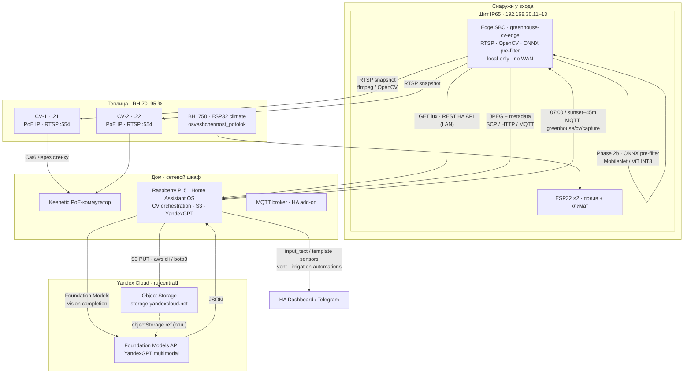
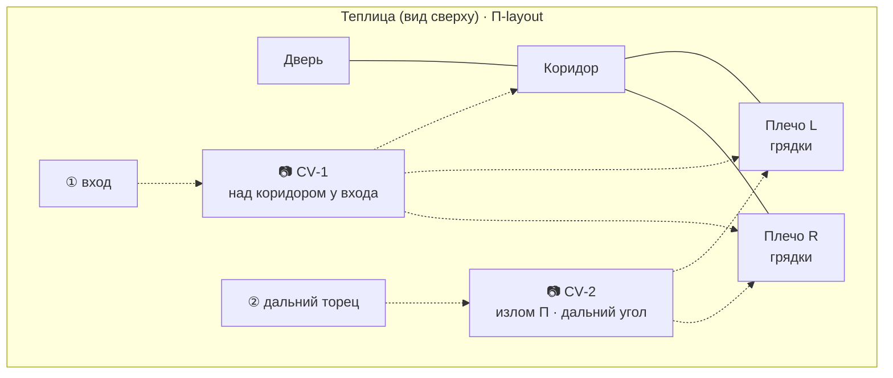

# Компьютерное зрение: мониторинг растений в теплице

← [04-esp32-and-cabinet](04-esp32-and-cabinet.md) | [Оглавление](smart-greenhouse-design.md) | [01-overview](01-overview.md) →

---

Документ описывает **проектное решение** для двух камер внутри теплицы и облачного анализа изображений **2 раза в сутки** (утро и вечер по фотопериоду). Цель — раннее выявление болезней, вредителей и признаков стресса у огурцов и помидоров с возвратом результатов в Home Assistant.

**Принятые решения (2026-06):**

| Решение | Выбор |
|---------|--------|
| Edge‑хост CV | **SBC в щите IP65 снаружи у входа** (Radxa ZERO 3W ★) — RTSP‑захват, опциональный локальный ONNX pre-filter, **передача снимков на Pi**; **без WAN**; **не** внутри теплицы (RH 70–95 %) |
| Облако CV | **Только РФ** — [Yandex AI Studio](https://aistudio.yandex.ru/) / Yandex Cloud Foundation Models (мультимодальный YandexGPT); **только с Raspberry Pi 5 / HA** |
| Хранение снимков | **Yandex Cloud Object Storage** (S3‑совместимый, `ru-central1`); upload с **Pi**; локальный кэш на edge SBC — 7–14 дней |
| Планировка грядок | **П‑образная от входа** (коридор + два плеча) — см. [03 §1.4.2](03-greenhouse-installation.md#142-п-образная-планировка-грядок-и-камеры-cv) |
| Алерты | Уведомления **и** связка с проветриванием / поливом (шаблонные условия по RH + класс CV) |
| Освещение съёмки | По **фотопериоду** и BH1750 (`sensor.osveshchennost_potolok`); без фиксированной LED‑вспышки в 18:00 |
| Связь edge ↔ HA | **Локальная сеть:** edge → Pi (SCP / HTTP POST / MQTT с метаданными); Pi → edge (MQTT trigger capture, HA REST для lux) |

Связанные разделы: триангуляция климата — [03 §1.4.1](03-greenhouse-installation.md#141-размещение-sht31--3-триангуляция-климата); профили культур — [01-overview.md §4.6](01-overview.md#46-профили-культур-огурцы--помидоры); сеть IoT VLAN — [01-overview.md §3](01-overview.md#3-настройка-wi-fi-и-mesh).

**Статус:** проект / фаза 0 — не входит в текущий BOM (~52 000 ₽). Реализация — поэтапно после стабилизации базовой автоматизации.

### 0.1.4. Сезонная эксплуатация CV

CV привязан к **сезону щита** ([03 §0.1](03-greenhouse-installation.md#01-сезонная-эксплуатация-монтаж-и-демонтаж-щита)):

| Компонент | Зима | Примечание |
|-----------|------|------------|
| **Edge SBC (Radxa ZERO 3W)** | **Со щитом** — питание off, хранение в сухом помещении | Без edge нет RTSP‑захвата и локальной передачи снимков на Pi |
| **PoE камеры внутри теплицы** | **На выбор владельца** | **A)** оставить на месте, **PoE off** на коммутаторе (объектив под плёнкой/чехлом — опц.); **B)** снять, хранить в сухом месте, Cat6 — заглушка на вводе |
| **Cat6 PoE** | Остаётся в теплице | При снятых камерах — защитить разъёмы; при оставленных — без питания зимой |

По умолчанию в проекте: **камеры могут остаться unpowered** (вариант A); **edge всегда уезжает со щитом**. Automations `greenhouse_cv.yaml.example` неактивны без edge и камер.

---

## 1. Цели и ограничения

| Цель | Ограничение |
|------|-------------|
| Раннее обнаружение болезней, вредителей, дефицита питания | Модели обучены на **крупных планах листьев**; общий вид грядки даёт меньшую точность |
| 2 снимка/день × 2 камеры = **~120 изображений/мес** | Низкая нагрузка на облако; **нет непрерывного** мониторинга между сессиями |
| Интеграция с HA и профилем культуры (`input_select.greenhouse_plant_profile`) | Камеры не заменяют SHT31/BH1750 — только визуальный слой |
| Соответствие 152‑ФЗ | Данные и inference **в РФ** (Yandex Cloud, регион `ru-central1`) |
| Бюджет hobby‑теплицы | Облачный inference дешевле GPU‑сервера; PoE предпочтительнее Pi Camera на длинных кабелях |

**Не входит в scope v1:** распознавание лиц, видеопоток 24/7, автоматическое опрыскивание по результатам CV.

---

## 2. Архитектура



**Роли узлов:**

| Узел | Роль | Не делает |
|------|------|-----------|
| **Edge SBC** (`.13`) | RTSP‑захват 2×/сутки; lux‑gate через HA REST API (LAN); опциональный ONNX pre-filter; **локальная передача** JPEG + метаданных на Pi; publish MQTT «ready» / pre-filter hints | **Нет WAN**; **нет** Yandex credentials; **не** upload в S3; **не** вызов Foundation Models |
| **Raspberry Pi 5** (HA) | Оркестрация расписания; приём снимков в `/config/greenhouse_cv/inbox/`; **upload Object Storage**; **YandexGPT** multimodal; парсинг JSON → HA entities; vent/irrigation coupling; Lovelace, Telegram | Не тянет RTSP с камер напрямую (камеры в теплице, Pi в шкафу; edge SBC — в щите **снаружи**) |
| **Yandex Cloud** | Primary storage + тяжёлый multimodal analysis (Phase 2a+) | Доступ **только** с Pi (HTTPS); не непрерывный inference 24/7 |

**Поток данных:**

1. HA на **Pi** в **07:00** и **sunset − 45 min** публикует MQTT `greenhouse/cv/capture` (или REST edge‑сервиса).
2. Edge SBC читает `sensor.osveshchennost_potolok` через **HA REST API** (локально); при lux ≥ порога (§4.1) — RTSP snapshot с CV‑1 и CV‑2.
3. **Phase 2b (опционально):** локальный **ONNX Runtime** на edge; при confidence > 0.85 и класс «healthy» — метка `prefilter_healthy` в метаданных (Pi может skip cloud).
4. Edge **передаёт JPEG** на Pi: SCP → `/config/greenhouse_cv/inbox/`, HTTP POST на локальный endpoint, или MQTT + отдельный SCP/rsync. **Yandex credentials не хранятся на Radxa.**
5. **Pi / HA:** `scripts/capture_and_analyze.sh` — S3 PUT + Foundation Models API (мультимодальный prompt с профилем культуры) → JSON в `input_text.greenhouse_cv_last_report`.
6. Automations на Pi: notify; при болезни + высокой RH — проветривание; при водном стрессе — подсказка полива (§7.4).

---

## 3. Аппаратура

### 3.1. Планировка грядок и камеры (П‑образная)

Грядки расположены **П‑образно от входа**: центральный **коридор** от двери к дальнему излому, по обе стороны коридора — **два плеча** грядок (левая и правая «руки» буквы П). Типичная теплица 3×4 … 3×6 м.

Подробная схема монтажа — [03 §1.4.2](03-greenhouse-installation.md#142-п-образная-планировка-грядок-и-камеры-cv).

| Камера | Зона | Высота / угол | Покрытие (П‑layout) |
|--------|------|---------------|---------------------|
| **CV‑1** | Над **коридором у входа**, на оси двери | ~2,2 м, наклон ~35° вниз по коридору | Первые 2–3 м **обоих плеч** у входа, капельные линии, форточка 1; зона ① SHT31 |
| **CV‑2** | **Излом П** — дальний угол, где коридор упирается в торец и начинаются плеча | ~2,5 м у конька **или** ~2,0 м на дальней стойке, наклон ~30° **к входу** | Дальние секции **левого и правого плеча** (blind spot CV‑1), форточка 2; зоны ②/③ SHT31 |



**Почему двух камер достаточно для П‑layout:**

- CV‑1 с широкоугольным объективом (2,8–4 mm) видит **оба плеча в перспективе** от точки входа — типичный «рабочий» обзор.
- CV‑2 смотрит **навстречу** CV‑1 и закрывает **дальние 40–50 %** каждого плеча, где перспектива CV‑1 сжимает детали листвы.
- Центральный blind spot между плечами у излома П минимален при высоте 2,2–2,5 m; третья камера — только Phase 3 при подтверждённом dead zone.

**Имена сущностей HA (пример):** `camera.greenhouse_cv_entrance` (CV‑1), `camera.greenhouse_cv_far` (CV‑2).

### 3.2. PoE IP vs Pi Camera Module 3

| Критерий | **PoE IP (рекомендуется ★)** | Pi Camera Module 3 + USB/CSI |
|----------|------------------------------|------------------------------|
| Расстояние до Pi (~5 m щит + ~15 m до домашнего шкафа) | Один Cat6 до PoE‑коммутатора | CSI ≤30 cm; USB extension ненадёжен на 10+ m |
| Влажность **70–95 % RH** внутри теплицы, конденсат на объективе | Корпус камеры IP66/IP67 + GORE vent, drip loop на Cat6 | Edge SBC и Pi **вне** влажного объёма — SBC в щите снаружи, Pi дома |
| Интеграция HA | Reolink / ONVIF / Generic RTSP | `rpi_camera` или go2rtc на Pi |
| Стоимость ×2 | ~14 000–22 000 ₽ | ~6 000 ₽ камеры + риски монтажа |

**Рекомендация ★:** две **PoE IP камеры** (802.3af), bullet или dome IP66/IP67, RTSP без обязательного облака производителя.

### 3.3. Защита от влаги и конденсата

**Камеры (внутри теплицы, RH 70–95 %):**

| Мера | Назначение |
|------|------------|
| Корпус **IP66/IP67** | Защита от брызг и пыли |
| **GORE Protective Vent** на корпусе камеры | Выравнивание давления, вывод влаги |
| Монтаж **внутри** теплицы, **козырёк** от капель с крыши | Меньше конденсата на объективе |
| **Drip loop** на Cat6 перед вводом в стенку/раму | Вода не стекает в RJ45 |
| **Cat6 наружный** от PoE‑коммутатора → ввод у двери → камеры | См. [03 §0](03-greenhouse-installation.md#0-щит-снаружи-датчики-и-камеры-внутри) |
| Съёмка в **световое окно** по BH1750 | Меньше «туманных» кадров на рассвете/сумерках |

**Щит / edge SBC (снаружи у входа):** конденсат в корпусе из‑за точки росы и влажного притока — [04 §1.3](04-esp32-and-cabinet.md#13-щит-ip65-снаружи-у-входа--контроллеры-и-питание) (Gore vent, силика‑гель, ориентация, опц. обогрев). **Не** путать с RH внутри теплицы: в щите целевой микроклимат сухой.

### 3.4. Edge SBC в щите IP65 (снаружи)

Камеры — PoE IP **внутри** теплицы (RH 70–95 %); **захват и inference** — на **Radxa ZERO 3W** в том же щите **снаружи у входа**, что ESP32. Pi 5 остаётся дома как HA‑сервер. RTSP — по Wi‑Fi/LAN VLAN; PoE‑кабели камер идут **через стенку** к домашнему PoE‑коммутатору, не через щит (данные). **Зимой SBC хранится вместе со снятым щитом** ([§0.1.4](#014-сезонная-эксплуатация-cv)).

#### 3.4.1. Рекомендация ★ — Radxa ZERO 3W (1 GB / 8 GB eMMC)

| Критерий | Radxa ZERO 3W ★ | Orange Pi Zero 2W (1–4 GB) | Raspberry Pi Zero 2 W | Orange Pi Zero 3W |
|----------|-----------------|----------------------------|----------------------|-------------------|
| SoC | RK3566 · 4× A55 @ 1.6 GHz | H618 · 4× A53 @ 1.5 GHz | BCM2710A1 · 4× A53 @ 1 GHz | A733 · 2× A76 + 6× A55 + **3 TOPS NPU** |
| RAM | 1 GB LPDDR4 | 1–4 GB LPDDR4 | **512 MB** (мало) | 1–4 GB LPDDR5 |
| Storage | **8 GB eMMC** + microSD | microSD | microSD | microSD + опц. eMMC |
| Wi‑Fi | 802.11 b/g/n/ac | Wi‑Fi 5 | Wi‑Fi 4 | Wi‑Fi 6 |
| ONNX + OpenCV + RTSP | ✅ ~2–5 s/кадр MobileNet INT8 | ✅ (1 GB — впритык) | ⚠️ RAM bottleneck | ✅✅ (NPU — Phase 3+) |
| Цена ★, ₽ (июнь 2026) | **~3 800** ([onpad.ru](https://onpad.ru/catalog/cubie/radxa/rock/radxa_zero_series/3542.html)) | ~4 500–6 400 | ~4 700 | ~5 000+ (новинка, редко в РФ) |
| Питание | USB‑C **5 V 2 A** | USB‑C 5 V 2 A | microUSB 5 V 2.5 A | USB‑C 5 V 3 A |

**Почему Radxa ZERO 3W ★:** встроенная eMMC (надёжнее microSD в уличном щите у влажного входа), 4 ядра достаточно для 2× snapshot/день + ONNX, **самая низкая цена** среди пригодных плат; форм‑фактор Pi Zero — монтаж на DIN‑плату.

**Не рекомендуется для v1:** RPi Zero 2W (512 MB RAM — OOM при OpenCV + ONNX); Luckfox (нет полноценного Debian, слабая документация под Python CV).

#### 3.4.2. Монтаж SBC в IP65 щите (снаружи)

| Мера | Назначение |
|------|------------|
| **Отдельная зона** на DIN‑плате, не на металле корпуса | Wi‑Fi не экранируется |
| **Вторая антенна Wi‑Fi** (U.FL → SMA, как у ESP32) через PG7 | RSSI −70…−80 dBm к Stellar 6 |
| Питание **5 V 2 A** от LRS‑50‑5 через **USB‑C buck** (отдельная ветка, не от ESP32 pin) | См. [04 §2.5](04-esp32-and-cabinet.md#25-схема-откуда--куда-щит-ip65) |
| **Silica gel** 50 g + **Gore vent** (общий с щитом) | Щит снаружи у влажного входа: риск **точки росы** в корпусе, не RH 70–95 % как в теплице; см. [04 §1.3](04-esp32-and-cabinet.md#13-щит-ip65-снаружи-у-входа--контроллеры-и-питание) |
| Пассивный радиатор на SoC | T_amb до +45 °C летом; нагрузка CV — 2×/сутки, не 24/7 |
| microSD **не обязателен** при eMMC; для Radxa — резервная SD опциональна | |
| Hostname / mDNS | `greenhouse-cv-edge` |

**PoE для SBC:** не используется — PoE идёт на **камеры** (802.3af через коммутатор в домашнем шкафу). SBC питается от **5 V БП щита**.

#### 3.4.3. ПО на edge

| Компонент | Назначение |
|-----------|------------|
| Debian / Armbian (официальный образ Radxa) | Базовая ОС |
| Python 3.11+ · OpenCV · ffmpeg | RTSP → JPEG |
| **ONNX Runtime** (`CPUExecutionProvider`) | Phase 2b — локальные HF‑модели |
| `paho-mqtt` | MQTT: subscribe `greenhouse/cv/capture`, publish `greenhouse/cv/ready` |
| `rsync` / `scp` / `curl` (HTTP POST) | Передача JPEG на Pi → `/config/greenhouse_cv/inbox/` |
| systemd timer или cron | Fallback расписания 07:00 / sunset−45m (если MQTT недоступен) |

**Не устанавливать на edge:** `boto3`, Yandex Cloud SDK, ключи Object Storage / Foundation Models.

Кэш снимков: `/var/lib/greenhouse_cv/` (7–14 дней, rotate). Референс edge‑скрипт (не в repo): `edge_capture.sh` — RTSP → JPEG → post to Pi.

### 3.5. Сеть и IP

| Параметр | Значение |
|----------|----------|
| VLAN | `IoT_Greenhouse` · 192.168.30.0/24 |
| Edge SBC | **`192.168.30.13`** · `greenhouse-cv-edge` · **local-only, no WAN** |
| Raspberry Pi 5 (HA) | домашний шкаф · PoE · **единственный IoT‑хост с HTTPS в Yandex Cloud** |
| Камеры | `192.168.30.21` (CV‑1), `192.168.30.22` (CV‑2) · **no WAN** |
| ESP32 | `.11` полив, `.12` климат · **no WAN** |
| Питание камер | Keenetic PoE‑коммутатор (802.3af), ~4–7 W на камеру |

**Firewall (Keenetic, IoT_Greenhouse):**

| Правило | Назначение |
|---------|------------|
| **DENY** IoT → Internet (по умолчанию) | ESP32, камеры, Radxa `.13` — без прямого WAN |
| **ALLOW** edge `.13` → cameras `.21/.22` TCP **554** (RTSP) | Захват снимков |
| **ALLOW** edge `.13` → Pi TCP **8123** (HA REST), **1883** (MQTT), **22** (SCP, опц.) | Lux‑gate, trigger, доставка JPEG |
| **ALLOW** Pi → edge `.13` TCP **1883**, REST (если edge слушает) | MQTT capture trigger |
| **ALLOW** Pi → Internet HTTPS **`storage.yandexcloud.net`**, **`llm.api.cloud.yandex.net`**, **`iam.api.cloud.yandex.net`** | S3 upload + Foundation Models (Phase 2a+) |
| **DENY** edge `.13` → Yandex Cloud | Radxa не обращается в облако |

NTP для IoT — опционально точечное разрешение или синхронизация через LAN.

---

## 4. Конвейер захвата и анализа

### 4.1. Расписание и фотопериод

| Сессия | Триггер | Обоснование |
|--------|---------|-------------|
| **Утро** | `07:00:00` | Совпадает с поливом; после ночного конденсата; растущий lux |
| **Вечер** | `sun` **sunset − 45 min** (не фиксированные 18:00) | Адаптация к длине дня; летом позже, осенью раньше |

**Пороги освещённости** (`sensor.osveshchennost_potolok`, BH1750 «потолок», [04 §2.3](04-esp32-and-cabinet.md)):

| Условие | Lux | Действие |
|---------|-----|----------|
| Достаточно для CV | ≥ **300** (утро), ≥ **150** (вечер, sunset−45m) | Snapshot → edge → Pi inbox → upload + API (Phase 2a) |
| Погранично | 150–299 (утро) | Snapshot локально; облако — только если нет blur (Phase 2+) |
| Темно | < **150** | **Skip** cloud; метка `skipped_dark`; см. §4.1.3 |
| Полив (сравнение) | > 500 | Используется в `greenhouse_irrigation_by_soil_moisture` — CV утром может снимать при 300+ |

Дополнительное условие утро: `sun` elevation > 5° (избегать глубоких сумерек при позднем/раннем поливе).

### 4.1.3. Недостаток света — skip или досветка

**Без фиксированной LED‑вспышки в 18:00.** Логика:

1. Если lux ≥ порога сессии → обычная съёмка.
2. Если lux < порога **и** `sun` above_horizon → опционально **краткая досветка** (Phase 3): белая LED ~5 W, **2 min**, затем повторный замер lux; только если профиль не «ночной покой».
3. Если lux < порога **и** sun below_horizon → **skip** (не будить растения искусственным светом ради CV).

Пример automations: `homeassistant/automations/greenhouse_cv.yaml.example`.

### 4.2. Компоненты: edge SBC + Pi / HA

| Компонент | Роль |
|-----------|------|
| Edge service `greenhouse-cv-edge` (`edge_capture.sh`, ref.) | RTSP capture, lux gate, optional ONNX pre-filter, **local post to Pi inbox** |
| HA automation `greenhouse_cv_capture_*` | Утро 07:00 / вечер sunset−45m → MQTT trigger edge |
| HA automation `greenhouse_cv_run_analysis` | Inbox ready → `shell_command` → `capture_and_analyze.sh` на **Pi** |
| `input_text.greenhouse_cv_last_report` | JSON последнего отчёта (после Pi‑side analyze) |
| Template `sensor.greenhouse_cv_health` | `healthy` / `stressed` / `diseased` / `uncertain` / `skipped_dark` |
| `scripts/capture_and_analyze.sh` | **На Pi:** S3 upload + YandexGPT API; вход — JPEG уже в `/config/greenhouse_cv/inbox/` |

### 4.3. Метаданные

```json
{
  "camera_id": "cv_entrance",
  "timestamp": "2026-06-28T07:00:05+03:00",
  "session": "am",
  "plant_profile": "Огурцы",
  "lux_ceiling": 1240,
  "lux_plants": 680,
  "sun_elevation": 12.4,
  "avg_rh": 71.2,
  "max_temp": 24.8,
  "s3_key": "greenhouse-cv/2026/06/28/0700_cv_entrance.jpg",
  "locale": "ru-RU"
}
```

---

## 5. Yandex Cloud: хранение и CV API

### 5.1. Object Storage (S3‑совместимый)

| Параметр | Значение |
|----------|----------|
| Endpoint | `https://storage.yandexcloud.net` |
| Region | `ru-central1` |
| API | Amazon S3 compatible (aws cli, boto3, s3cmd) |
| Bucket (пример) | `greenhouse-cv-prod` |
| Ключ объекта | `greenhouse-cv/{YYYY}/{MM}/{DD}/{HHmm}_{camera_id}.jpg` |
| ACL | Private; доступ сервисному аккаунту FM + HA static key |
| Lifecycle | Standard → Cold через 90 дней (сезон); удаление через 365 дней (настраивается) |

**Локальный каталог на Pi:** `/config/greenhouse_cv/inbox/` — вход от edge; `/config/greenhouse_cv/` — после analyze. HA Lovelace — последние снимки из inbox или signed S3 URL.

**Аутентификация:** static access key сервисного аккаунта с ролью `storage.editor`; ключи в **`homeassistant/secrets.yaml`** на Pi (не в git, **не на Radxa**).

### 5.2. Yandex AI Studio / Foundation Models (vision)

| Параметр | Значение |
|----------|----------|
| Консоль | [aistudio.yandex.ru](https://aistudio.yandex.ru/) |
| REST endpoint | `POST https://llm.api.cloud.yandex.net/foundationModels/v1/completion` |
| Модель (URI) | `gpt://{folder_id}/yandexgpt/latest` или `yandexgpt-pro` / **YandexGPT Pro 5.1** (multimodal) |
| Auth | `Authorization: Api-Key {YANDEX_CLOUD_API_KEY}` или `Bearer {IAM_TOKEN}` |
| Роль сервисного аккаунта | `ai.languageModels.user` (+ `ai.vision.user` при OCR) |
| Формат vision | `messages[]` с `role: user`, `text` (prompt) + изображение **base64** в теле **или** ссылка на объект в Object Storage (`file.objectStorage.bucket` + `object`) |
| Ответ | JSON в `result.alternatives[0].message.text` — парсить structured prompt |

**Vision OCR** (отдельный API, не phytopathology): `POST https://ocr.api.cloud.yandex.net/ocr/v1/recognizeText` — для документов/этикеток, **не** для мониторинга листвы. Для теплицы — **мультимодальный YandexGPT** с ag‑prompt.

**SDK:** [yandex-cloud-ml-sdk](https://github.com/yandex-cloud/yandex-cloud-ml-sdk) (Python), `AIStudio(folder_id=..., auth=...)`.

### 5.3. Пример prompt (YandexGPT)

```
Ты — ассистент теплицы в средней полосе России. Культура: {plant_profile}.
Проанализируй снимок теплицы (П‑образные грядки). Верни ТОЛЬКО JSON:
{
  "health": "healthy|stressed|diseased|uncertain",
  "findings": [{"class": "...", "confidence": 0.0-1.0, "location": "left_arm|right_arm|corridor"}],
  "likely_issues": ["powdery_mildew", "downy_mildew", "water_stress", "late_blight", ...],
  "max_confidence": 0.0-1.0,
  "recommendation_ru": "..."
}
Ищи: мучнистую росу, пероносporoz, фитофтору, водный стресс, тлю, пожелтение.
Если кадр тёмный/размытый — health=uncertain. Ответ на русском в recommendation_ru.
```

### 5.4. Тарификация (ориентир, ₽, 2025–2026)

Цены Yandex Cloud — [Foundation Models pricing](https://yandex.cloud/ru/docs/foundation-models/pricing), [Object Storage pricing](https://yandex.cloud/ru/docs/storage/pricing). Billing в **рублях**, данные в **РФ**.

| Сервис | Расчёт для проекта (~120 img/мес) | Оценка ₽/мес |
|--------|-----------------------------------|--------------|
| **YandexGPT Lite** sync | ~1,5k input + 500 output tok × 120 ≈ 240k tok; Lite ≈ 1× base (~0,20–0,40 ₽/1k tok) | **~50–120 ₽** |
| **YandexGPT Pro 5.1** sync | 2× base rate; тот же объём | **~100–250 ₽** |
| **Object Storage Standard** | ~120 JPEG × 400 KB ≈ 48 MB/мес; ~1,9–2,4 ₽/GB‑мес | **< 1 ₽** (1 GB free tier) |
| PUT/GET запросы | < 500/мес | **0 ₽** (free tier) |
| Исходящий трафик в internet | HA → YC upload ~50 MB | **~5–10 ₽** |

**Итого сезон (5 мес):** порядка **300–1 500 ₽** — доминирует не inference, а время на калибровку prompt и разбор false positives.

**152‑ФЗ / residency:** primary copy в Object Storage `ru-central1`; inference Foundation Models в Yandex Cloud РФ; трансграничная передача **не используется** (в отличие от OpenAI US).

### 5.5. Отклонённые альтернативы

| Решение | Причина отказа |
|---------|----------------|
| OpenAI GPT‑4o Vision | Данные вне РФ; не соответствует решению «RF only» |
| Roboflow US cloud | То же; допустим только self‑host RF VPS |
| Локальный 30/90 day retention на Pi | Заменён Object Storage как primary |

---

## 6. Классы детекции: реалистичность

| Класс / симптом | Реалистичность | Примечание |
|-----------------|----------------|------------|
| **Пожелтение / некроз** | Высокая | Видно на wide shot при прогрессии |
| **Мучнистая роса** | Средняя–высокая | → связка с проветриванием при высокой RH |
| **Фитофтора / поздняя гниль** | Средняя | Помидор критичнее |
| **Водный стресс** | Средняя | → корреляция с RH + подсказка полива |
| **Паутинный клинец, тля** | Низкая–средняя | Мелкие объекты |
| **Недостаток света** | Средняя | Дублирует BH1750 |

**Практика:** CV **дополняет** датчики. Двойное подтверждение (утро + вечер) перед critical alert.

**Честная оценка micronutrients vs disease:** модели PlantVillage и большинство HF‑репозиториев обучены на **крупных планах больных листьев** в лабораторных условиях. **Болезни** (мучнистая роса, фитофтора, septoria) на wide‑shot теплицы — **средняя** реалистичность; локальный MobileNet полезен как **pre-filter**, не как диагноз. **Дефицит N/P/K/Mg** и **micronutrients** — на Hugging Face **почти нет** готовых edge‑моделей с валидацией; единственный релевантный класс в [valla2345/bell-pepper-disease-classifier](https://huggingface.co/valla2345/bell-pepper-disease-classifier) — общий `Nutrient deficiency` без разбивки по элементам. Для микроэлементов надёжнее **YandexGPT multimodal** (Phase 2a) + RH/lux контекст, чем ONNX на edge. Fine‑tune на своих кадрах теплицы — Phase 3+.

---

## 6.5. Hugging Face — shortlist для edge (Phase 2b)

Критерии отбора: hobby‑лицензия (MIT / Apache 2.0), пригодность для ONNX/CPU, релевантность культурам теплицы, наличие card/README. **Cucumber** в PlantVillage **нет** — ближайший прокси: **Squash Powdery mildew** (родственная мучнистая роса); для огурца — облачный YandexGPT или дообучение.

### Томат (10 классов PlantVillage + специализированные)

| # | Модель | Архитектура | Input | Классы (релевантные) | Edge | License | HF |
|---|--------|-------------|-------|----------------------|------|---------|-----|
| 1 | [rarfileexe/Plant-Disease-Detector](https://huggingface.co/rarfileexe/Plant-Disease-Detector) | MobileNetV2 | 224×224 | 10 tomato + 28 др. | Keras → ONNX export | MIT | ~39 DL/mo |
| 2 | [Daksh159/plant-disease-mobilenetv2](https://huggingface.co/Daksh159/plant-disease-mobilenetv2) | MobileNetV2 | 224×224 | 38 (10 tomato) | PyTorch `.pth`, ~14 MB | — | 5 Spaces |
| 3 | [surprisedPikachu007/tomato-disease-detection](https://huggingface.co/surprisedPikachu007/tomato-disease-detection) | ViT-base | 224×224 | Tomato-only (~10) | 86M params — тяжело для Zero | Apache 2.0 | ~8 DL/mo |
| 4 | [animeshakr/plant-disease-efficientnetv2s](https://huggingface.co/animeshakr/plant-disease-efficientnetv2s) | EfficientNetV2S | 384×384 | 38 (10 tomato) | TFLite float16 ~45 MB | — | ~35 DL/mo |
| 5 | [yanami3/agri-plant-disease-resnet50](https://huggingface.co/yanami3/agri-plant-disease-resnet50) | ResNet50 | 224×224 | 38 (10 tomato) | 91 MB — borderline | Apache 2.0 | — |
| 6 | [Abuzaid01/plant-disease-classifier](https://huggingface.co/Abuzaid01/plant-disease-classifier) | EfficientNet-B2 | 224×224 | 14 (6 tomato + apple + corn) | Transformers | — | ~38 DL/mo |
| 7 | [DrUkachi/ktt-crop-disease-classifier](https://huggingface.co/DrUkachi/ktt-crop-disease-classifier) | MobileNetV3-Small | 224×224 | 5 (не tomato — maize/bean) | **ONNX INT8 4.34 MB** ★ edge | MIT | — |

**Рекомендация для edge (tomato):** экспорт [rarfileexe/Plant-Disease-Detector](https://huggingface.co/rarfileexe/Plant-Disease-Detector) или [DrUkachi](https://huggingface.co/DrUkachi/ktt-crop-disease-classifier) pipeline в ONNX INT8; фильтровать выход по префиксу `Tomato___`.

### Огурец / тыква (proxy — нет класса Cucumber в PlantVillage)

| # | Модель | Input | Классы для теплицы | Примечание | HF |
|---|--------|-------|-------------------|------------|-----|
| 1 | [rarfileexe/Plant-Disease-Detector](https://huggingface.co/rarfileexe/Plant-Disease-Detector) | 224×224 | `Squash___Powdery_mildew` | Прокси пероносporоз/мучнистая на Cucurbitaceae | ★ |
| 2 | [Daksh159/plant-disease-mobilenetv2](https://huggingface.co/Daksh159/plant-disease-mobilenetv2) | 224×224 | Squash powdery mildew | То же | ★ |
| 3 | [wambugu71/crop_leaf_diseases_vit_onnx](https://huggingface.co/wambugu71/crop_leaf_diseases_vit_onnx) | ViT | Corn/potato/rice/wheat | **Не cucumber** — только если нет альтернативы | ONNX INT8 |
| 4 | [JK-TK/PlantDiseaseDetection](https://huggingface.co/JK-TK/PlantDiseaseDetection) | YOLOv11x | 116 классов, field+lab | ONNX 113 MB — тяжело; detection bbox | ~14 DL/mo |

**Для огурца:** Phase 2a YandexGPT primary; edge ONNX — только `powdery_mildew`/`downy_mildew` hints через squash proxy + низкий weight в alert logic.

### Перец (баклажанный профиль — optional)

| # | Модель | Input | Классы | Edge | License | HF |
|---|--------|-------|--------|------|---------|-----|
| 1 | [valla2345/bell-pepper-disease-classifier](https://huggingface.co/valla2345/bell-pepper-disease-classifier) | 224×224 | **13**: bacterial spot, powdery mildew, mosaic, **nutrient deficiency**, healthy… | ResNet50 ~98 MB | Apache 2.0 | ★ |
| 2 | [rarfileexe/Plant-Disease-Detector](https://huggingface.co/rarfileexe/Plant-Disease-Detector) | 224×224 | Pepper bell: bacterial spot, healthy | MobileNetV2 | MIT | ★ |
| 3 | [Keetawan/clip-vit-large-patch14-plant-disease-finetuned](https://huggingface.co/Keetawan/clip-vit-large-patch14-plant-disease-finetuned) | 224×224 | 42 classes incl. pepper | CLIP ViT-L — **не для edge** | — | — |

### Общие (multi-crop, 38 классов PlantVillage)

| # | Модель | Input | Params / size | Accuracy (claimed) | Edge fit | HF |
|---|--------|-------|---------------|-------------------|----------|-----|
| 1 | [DrUkachi/ktt-crop-disease-classifier](https://huggingface.co/DrUkachi/ktt-crop-disease-classifier) | 224×224 | **4.34 MB INT8 ONNX** | macro-F1 0.987 noisy | ★★★ best edge | [link](https://huggingface.co/DrUkachi/ktt-crop-disease-classifier) |
| 2 | [Gopina/maize-disease-classifier](https://huggingface.co/Gopina/maize-disease-classifier) | 224×224 | 1.2 MB INT8 ONNX | 5 classes | ★★ (не tomato/cucumber) | [link](https://huggingface.co/Gopina/maize-disease-classifier) |
| 3 | [rarfileexe/Plant-Disease-Detector](https://huggingface.co/rarfileexe/Plant-Disease-Detector) | 224×224 | ~14 MB Keras | 98.75% test | ★★ export ONNX | [link](https://huggingface.co/rarfileexe/Plant-Disease-Detector) |
| 4 | [Daksh159/plant-disease-mobilenetv2](https://huggingface.co/Daksh159/plant-disease-mobilenetv2) | 224×224 | MobileNetV2 | 95% val | ★★ | [link](https://huggingface.co/Daksh159/plant-disease-mobilenetv2) |
| 5 | [sudhir75/Harimitra](https://huggingface.co/sudhir75/Harimitra) | 256×256 | 31 MB Keras | 38 classes | ★ | [link](https://huggingface.co/sudhir75/Harimitra) |
| 6 | [wambugu71/crop_leaf_diseases_vit](https://huggingface.co/wambugu71/crop_leaf_diseases_vit) + [ONNX](https://huggingface.co/wambugu71/crop_leaf_diseases_vit_onnx) | ViT | INT8 quant | corn/potato/rice/wheat | ★ field crops | [link](https://huggingface.co/wambugu71/crop_leaf_diseases_vit_onnx) |
| 7 | [kero2111/Plant_Disease](https://huggingface.co/kero2111/Plant_Disease) | 224×224 | InceptionResNetV2 | 38 classes | ⚠️ heavy | [link](https://huggingface.co/kero2111/Plant_Disease) |

### Nutrient deficiency / stress (ограниченная база на HF)

| # | Модель | Input | Классы | Реалистичность для теплицы | HF |
|---|--------|-------|--------|---------------------------|-----|
| 1 | [valla2345/bell-pepper-disease-classifier](https://huggingface.co/valla2345/bell-pepper-disease-classifier) | 224×224 | 1× `Nutrient deficiency` (без N/P/K) | Низкая для огурца/томата; OK для перца | ★ единственный HF class |
| 2 | — rice/coffee papers | — | N/P/K split | **Нет готовых HF ONNX** | см. Springer/Frontiers papers |
| 3 | YandexGPT multimodal (Phase 2a) | wide shot | текстовый JSON | **Средняя** — контекст RH/lux | облако РФ |

**Deploy pipeline (Phase 2b):**

```bash
# On edge SBC — example with pre-exported ONNX (no cloud SDK)
pip install onnxruntime opencv-python-headless paho-mqtt
python -c "
import onnxruntime as ort
sess = ort.InferenceSession('plant_disease_int8.onnx', providers=['CPUExecutionProvider'])
# input: NCHW 1x3x224x224, ImageNet normalize
"
# Post JPEG to Pi: scp snapshot.jpg pi@192.168.1.x:/config/greenhouse_cv/inbox/
```

Модели без ONNX в репозитории: export через `optimum` / `tf2onnx` / `torch.onnx.export` на dev‑машине; quantize INT8 на Radxa или x86.

---

## 7. Возврат результатов в Home Assistant

### 7.1. Сущности

| Entity | Тип | Назначение |
|--------|-----|------------|
| `input_text.greenhouse_cv_last_report` | input_text | JSON последнего ответа |
| `sensor.greenhouse_cv_health` | template | Сводный статус |
| `binary_sensor.greenhouse_cv_alert` | template | on если diseased + confidence > 0.75 |
| `camera.greenhouse_cv_entrance` / `_far` | camera | Источники snapshot |

### 7.2. Каналы доставки

| Метод | Когда |
|-------|-------|
| **notify.persistent_notification** / Telegram | Каждый diseased / stressed alert |
| **Automation → vent / irrigation** | §7.4 |
| **Recorder** | История `sensor.greenhouse_cv_health` |

### 7.3. Связь с профилем культуры

- Metadata API включает `input_select.greenhouse_plant_profile`.
- Помидор — **ниже** порог RH для mildew‑vent (согласовано с `greenhouse_vent_humidity_max`).

### 7.4. Алерты и связка с проветриванием / поливом

| Сценарий CV | Условие климата | Действие HA |
|-------------|-----------------|-------------|
| `likely_issues` содержит `powdery_mildew` или `downy_mildew` | `sensor.teplitsa_srednyaya_vlazhnost` ≥ `input_number.greenhouse_vent_humidity_max` − 5 | **Проветривание:** `cover.set_cover_position` 60–80 % на `cover.fortochka_1/2` + notify |
| `water_stress` или `health=stressed` + wilting | avg RH < `input_number.greenhouse_irrigation_humidity_min` | **Подсказка полива:** notify; опционально подготовить `number.greenhouse_watering_poliv_tselevoy_obem` **без** auto‑start (ручное подтверждение) |
| `diseased`, confidence > 0.75 | — | Notify + logbook; vent только при mildew + RH (выше) |
| `uncertain` / `skipped_dark` | — | Без vent/irrigation |

Примеры automations: `greenhouse_cv.yaml.example` (`greenhouse_cv_mildew_vent_boost`, `greenhouse_cv_water_stress_irrigation_hint`).

**Безопасность:** автоматический полив по CV **не включается** без явного решения (конфликт с «полив по RH» в 07:00); только уведомление‑hint.

---

## 8. Отказы и ложные срабатывания

| Сценарий | Поведение |
|----------|-----------|
| Камера offline | Retry 2×; notify «CV capture failed» |
| lux < порога | Skip cloud; `skipped_dark` |
| S3 upload fail | Retry 3×; локальный кэш сохраняется |
| API timeout | Queue; retry 15 min (max 2) |
| False positive mildew | **2 последовательных** срабатывания (утро+вечер) перед vent boost |
| Зима / короткий день | Вечерняя сессия сдвигается на sunset−45m; при lux < 150 — skip |

---

## 9. Конфиденциальность

| Требование | Реализация |
|------------|------------|
| **152‑ФЗ** | Primary storage и inference в Yandex Cloud РФ; upload **с Pi** |
| **Минимизация** | Crop грядок; bucket private; lifecycle delete |
| **Секреты** | `yandex_cloud_api_key`, `yandex_s3_access_key` в **`homeassistant/secrets.yaml` на Pi**; **не на edge SBC** |
| **FOV** | Камеры не видят участок за пределами теплицы |

---

## 10. Поэтапное внедрение

### Phase 1 — Capture + edge → Pi (1–2 недели)

- [ ] 2× PoE камер, монтаж П‑layout, IP .21/.22
- [ ] **Radxa ZERO 3W** в щите **снаружи у входа**, IP `.13`, Wi‑Fi IoT-GH, **firewall: no WAN**
- [ ] Edge service: RTSP snapshot утро / sunset−45m с lux‑gate (HA REST API)
- [ ] Локальная передача JPEG на Pi `/config/greenhouse_cv/inbox/`; Lovelace «последние снимки»

### Phase 2a — YandexGPT analysis на Pi (2–4 недели)

- [ ] `capture_and_analyze.sh` на **Pi** + service account в HA secrets
- [ ] Template sensors + notify на HA после analyze
- [ ] Журнал false positives

### Phase 2b — Local ONNX pre-filter на edge (опционально)

- [ ] ONNX MobileNetV2 / DrUkachi INT8 на edge
- [ ] Метка `prefilter_healthy` в metadata → Pi может skip cloud
- [ ] Profile-aware class filter (`input_select.greenhouse_plant_profile`)

### Phase 3 — Profile alerts + actuators (сезон)

- [ ] Vent boost / irrigation hints (§7.4)
- [ ] Двойное подтверждение mildew
- [ ] Опционально LED pre‑flash при пограничном lux

---

## 11. BOM (дополнение)

| Комponent | Кол-во | Цена ★, ₽ | Сумма, ₽ |
|-----------|--------|-----------|----------|
| PoE IP камера 5 MP IP66 | 2 | 6 000–9 000 | 14 000 |
| **Radxa ZERO 3W 1GB/8GB eMMC** | 1 | 3 500–4 200 | 3 800 |
| USB‑C buck 5 V 3 A + кабель | 1 | 300–600 | 450 |
| Wi‑Fi антенна U.FL для SBC (опц.) | 1 | 200–400 | 300 |
| microSD 32 GB (резерв, опц.) | 1 | 400–700 | 500 |
| Cat6 в теплицу (если нет) | 30–40 m | 50–80/м | 2 500 |
| GORE vent, крепёж | 2 | 300–800 | 1 000 |
| **Итого CV hardware** | | | **~22 550** |
| Yandex Cloud (сезон 5 мес) | — | см. §5.4 | **~300–1 500 ₽** |

*См. также `tools/bom/generate_bom.py` (категория «Computer vision (optional)»).*

---

## 12. Принятые решения (архив)

Ранее открытые вопросы закрыты решениями от 2026-06 — см. таблицу в начале документа и [03 §1.4.2](03-greenhouse-installation.md#142-п-образная-планировка-грядок-и-камеры-cv).

---

## 13. Связанные файлы

| Файл | Назначение |
|------|------------|
| `homeassistant/automations/greenhouse_cv.yaml.example` | Pi orchestration: MQTT trigger, inbox, analyze, vent/irrigation coupling |
| `scripts/capture_and_analyze.sh` | **Pi-side:** S3 upload + YandexGPT API (input from inbox) |
| `edge_capture.sh` (ref., deploy on Radxa) | RTSP capture + local post to Pi — см. §3.4.3 |
| `docs/03-greenhouse-installation.md` | П‑layout, позиции камер |

---

## Приложение A. Yandex API quick reference

| Операция | Endpoint |
|----------|----------|
| S3 PUT object | `PUT https://storage.yandexcloud.net/{bucket}/{key}` |
| FM completion | `POST https://llm.api.cloud.yandex.net/foundationModels/v1/completion` |
| FM async | `POST .../foundationModels/v1/completionAsync` (дешевле 50 % async) |
| IAM token | `POST https://iam.api.cloud.yandex.net/iam/v1/tokens` |

**Env vars (скрипт на Pi):** `YC_FOLDER_ID`, `YC_API_KEY`, `YC_S3_BUCKET`, `YC_S3_ACCESS_KEY`, `YC_S3_SECRET_KEY`, `YC_S3_ENDPOINT` (default `https://storage.yandexcloud.net`). Задавать через `shell_command` / HA secrets — **не на Radxa**.

---

*Документ подготовлен для проекта smart-greenhouse. Перед заказом камер проверьте PoE budget и покрытие кадра на объекте с П‑layout.*

---

← [04-esp32-and-cabinet](04-esp32-and-cabinet.md) | [Оглавление](smart-greenhouse-design.md) | [01-overview](01-overview.md) →
