# Проектирование системы умной теплицы на Home Assistant

Документ описывает полный цикл проектирования, подбора компонентов, сборки и эксплуатации системы автоматизации теплицы. Центральный сервер — Home Assistant (PoE, SSD); периферия — два контроллера ESP32 в щите IP65 у теплицы (~5 м от точки Wi‑Fi Mesh).

**Соглашения об именовании** (репозиторий `smart-greenhouse`, конфигов ESPHome/HA пока нет):

| Объект | Имя |
|--------|-----|
| ESP32 №1 | `greenhouse-watering` |
| ESP32 №2 | `greenhouse-climate` |
| Префикс сущностей HA | `greenhouse_*` |

---

## 1. Подбор компонентов

> Цены ориентировочные для РФ, весна–лето 2025–2026 гг. (Ozon, Яндекс Маркет, iArduino, Чип и Дип, профильные магазины). Перед заказом проверяйте актуальную стоимость и наличие.

### 1.1. Серверная часть (дом, сетевой шкаф)


*Рекомендуемая связка ★: Raspberry Pi 5 4 ГБ + Waveshare PoE M.2 HAT+ + NVMe 128 ГБ.*

| Узел | Бюджет | Сбалансированный ★ | Премиум | Поиск / ссылка |
|------|--------|-------------------|---------|----------------|
| Плата HA | Raspberry Pi 4 Model B 4 ГБ | **Raspberry Pi 5 4 ГБ** | Raspberry Pi 5 8 ГБ | `Raspberry Pi 5 4GB купить` — [iArduino](https://www.iarduino.ru/shop/boards/raspberry-pi-5-4gb.html), [robotclass.ru](https://shop.robotclass.ru/) |
| PoE | PoE HAT для Pi 4 (802.3af) | **Waveshare PoE M.2 HAT+ для Pi 5** (802.3at) | Официальный Raspberry Pi PoE+ HAT | `Waveshare PoE M.2 HAT+ Pi 5` |


| Накопитель | USB SSD 128 ГБ (Kingston SA400) + переходник USB 3.0 | **NVMe 128 ГБ 2230** (Kingston NV2 / WD SN580) в M.2 HAT | NVMe 256 ГБ + резервная копия на USB | `NVMe 2230 128GB`, `SSD USB 3.0 128GB` |
| Охлаждение | Пассивный радиатор Pi 4 | **Active Cooler Pi 5** + корпус с вентиляцией шкафа | Корпус Argon NEO 5 + температурный монитор | `Raspberry Pi 5 Active Cooler` |
| ОС | Home Assistant OS (официальный образ) | Home Assistant OS | HA OS + add-on InfluxDB/Grafana | [home-assistant.io/installation](https://www.home-assistant.io/installation/) |
| Альтернатива Pi | Orange Pi 5 / x86 NUC б/у | — | Home Assistant Green (готовое устройство) | `Home Assistant Green купить` |

**Рекомендация ★:** Raspberry Pi 5 4 ГБ + Waveshare PoE M.2 HAT+ + NVMe 128 ГБ. Загрузка с NVMe надёжнее microSD при постоянной записи истории HA.

| Компонент | Кол-во | Цена ★, ₽ | Сумма, ₽ |
|-----------|--------|-----------|----------|
| Raspberry Pi 5 4 ГБ | 1 | 13 000–15 000 | 14 000 |
| Waveshare PoE M.2 HAT+ | 1 | 3 500–4 500 | 4 000 |
| NVMe 128 ГБ 2230 | 1 | 2 000–2 800 | 2 400 |
| Active Cooler + корпус | 1 | 1 500–2 500 | 2 000 |
| Patch‑cord Cat6 в шкаф | 1 | 200–400 | 300 |
| **Итого сервер** | | | **~22 700** |

---

### 1.2. Сеть Mesh


*Mesh‑узел Stellar 6 (PoE 802.3af) и маршрутизатор Keenetic Speedster в сетевом шкафу; отдельный PoE‑инжектор не требуется.*

| Узел | Бюджет | Сбалансированный ★ | Премиум |
|------|--------|-------------------|---------|
| Маршрутизатор | Keenetic 4G / Start | **Keenetic Speedster (KN-3013)** | Keenetic Ultra / Giga |
| Mesh‑узел | — | **Netcraze Stellar 6** (уже в наличии) | **Netcraze Stellar 6** (уже в наличии) |
| PoE в шкафу | — | **Keenetic PoE‑коммутатор (уже есть)** — Pi HA (PoE HAT) и Stellar 6, без инжектора | Второй PoE‑коммутатор или порты PoE+ (802.3at) при росте нагрузки |

Поиск: `Keenetic Speedster KN-3013`, `Netcraze Stellar 6 mesh`

**Питание ★:** Stellar 6 поддерживает PoE (802.3af); сервер HA — через Waveshare PoE M.2 HAT+ (802.3at). Оба устройства подключаются к **уже установленному Keenetic PoE‑коммутатору** в сетевом шкафу патч‑кордами Cat6 (для AP — наружный кабель). Отдельный PoE‑инжектор не требуется.

---

### 1.3. Щит IP65 у теплицы — контроллеры и питание


*Щит IP65 ★: два ESP32‑WROOM‑32U, Mean Well LRS‑50‑5 / LRS‑100‑12, реле 12 В опто, PCA9685, диоды 1N4007, металлический щит DKC 300×400.*


| Узел | Бюджет | Сбалансированный ★ | Премиум | Поиск |
|------|--------|-------------------|---------|-------|
| ESP32 (2 шт.) | ESP32‑DevKitC на WROOM‑32 (PCB‑антенна) + внешняя антенна с переходником | **ESP32‑DevKitC на ESP32‑WROOM‑32U** (разъём U.FL/IPEX) | ESP32‑WROVER‑E 16 МБ + U.FL | `ESP32 WROOM 32U DevKit U.FL` |
| Внешняя антенна 2.4 ГГц | 2 dBi pigtail U.FL → SMA, 15 см | **5 dBi omnii, кабель 50 см**, IP65 | 8 dBi направленная на AP | `WiFi антенна 2.4GHz U.FL pigtail` |
| БП 5 В логика | Mean Well RS‑15‑5 (15 Вт) | **Mean Well LRS‑50‑5** (50 Вт, 10 А) | Дублирующий БП + ORing | `Mean Well LRS-50-5` |
| БП 12 В силовой | 12 В 3 А блок | **Mean Well LRS‑100‑12** (8.5 А) | 12 В 10 А + ИБП 12 В | `Mean Well LRS-100-12` |
| ИБП 12 В (опц.) | — | **Mini UPS 12 В 3 А** на клапаны/реле | ИБП 12 В 60 Вт | `ИБП 12V DC mini UPS` |
| Щит IP65 | Пластик 300×400×200 IP65 | **DKC R5ST0342 300×400×200** металл IP65 | 400×500×250 + клапан Gore | `щит IP65 300x400 DKC` |
| DIN‑рейка + клеммы | Клеммники винтовые | **WAGO 221‑412/413** (набор) | WAGO + маркировка | `WAGO 221 набор` |
| Сальники | PG7/PG9 пластик | **PG7/PG9 + PG11**, IP68 латунь | Многоразовые EMC‑вводы | `сальник PG9 IP68` |
| Кабель сигнальный | UTP Cat5e outdoor | **FTP Cat5e экранированный** наружный | SFTP + гофра UV | `FTP Cat5e 4 пары наружный` |
| Клапан выравнивания | — | **Gore vent IP67** на щит | — | `Gore vent IP67 электрощит` |

| Компонент | Кол-во | Цена ★, ₽ | Сумма, ₽ |
|-----------|--------|-----------|----------|
| ESP32‑WROOM‑32U DevKit | 2 | 800–1 200 | 2 000 |
| Антенна 5 dBi + pigtail | 2 | 350–600 | 900 |
| Mean Well LRS‑50‑5 | 1 | 1 800–2 400 | 2 100 |
| Mean Well LRS‑100‑12 | 1 | 2 500–3 200 | 2 850 |
| Реле 12 В опто (2‑кан.) | 2 | 250–450 | 700 |
| PCA9685 16‑канальный | 1 | 600–700 | 650 |
| Диоды 1N4007 (уже в наличии) | 4 | 0 | 0 |
| Щит DKC 300×400 IP65 | 1 | 4 500–6 500 | 5 500 |
| WAGO 221, сальники, DIN | 1 компл. | — | 2 500 |
| FTP‑кабель 50 м | 1 | 2 000–3 500 | 2 800 |
| **Итого щит (без датчиков/актуаторов)** | | | **~20 000** |

---

### 1.4. Датчики

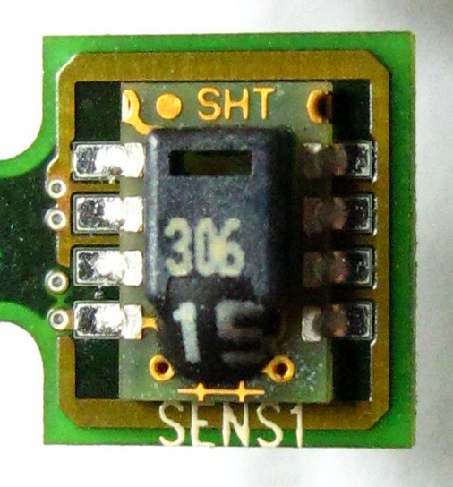

*Датчики ★: SHT31 ×3, BH1750 ×2, DS18B20 waterproof ×2, поплавок уровня, YF‑S201 ×2.*

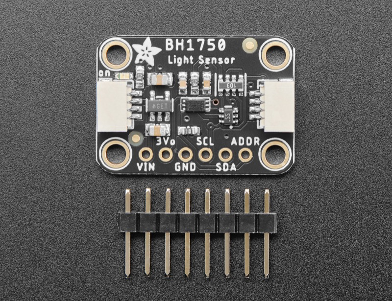

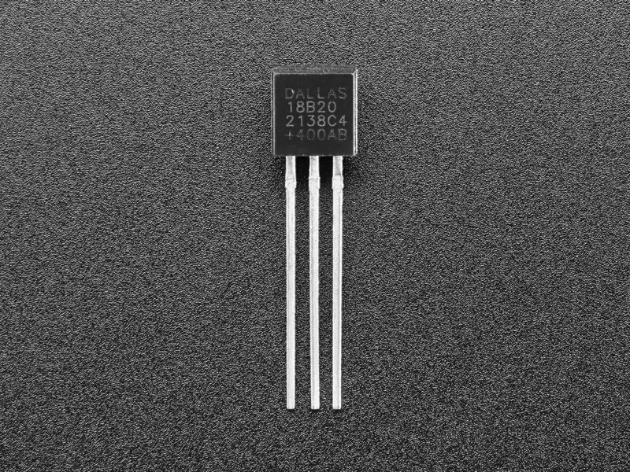

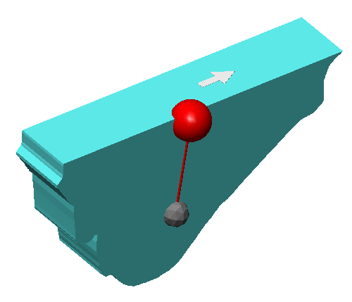

| Датчик | Бюджет | Сбалансированный ★ | Премиум | Поиск |
|--------|--------|-------------------|---------|-------|
| T/H воздуха ×3 | SHT30 модуль GY‑SHT30 | **SHT31 (GY‑SHT31‑D)** | SHT35 + фильтр PTFE | `SHT31 GY-SHT31 I2C` — [youbot.ru](https://www.youbot.ru/product/tsifrovoy-datchik-temperatury-i-vlazhnosti-gy-sht31d) |
| Освещённость ×2 | BH1750 GY‑302 | **BH1750 GY‑302** (ADDR 0x23/0x5C) | VEML7700 (альтернатива) | `BH1750 GY-302 модуль` |
| T воды ×2 | DS18B20 в гильзе | **DS18B20 waterproof 1 м** | DS18B20 3 м + термопаста | `DS18B20 водонепроницаемый` |
| Уровень воды | Поплавок NO 220 В → через SSR | **Поплавок 12–24 В NO/NC** на 5 В логику | Ультразвук JSN‑SR04T | `поплавковый датчик уровня воды 12V` |
| Поток ×2 | YF‑S201 | **YF‑S201 1/2"** | YF‑B5 (больше диапазон) | `YF-S201 датчик расхода` — [iArduino](https://iarduino.ru/shop/Sensory-Datchiki/datchik-rashoda-vody-1-2-dyuyma.html) |

| Датчик | Кол-во | Цена ★, ₽ | Сумма, ₽ |
|--------|--------|-----------|----------|
| SHT31 | 3 | 300–450 | 1 050 |
| BH1750 | 2 | 150–250 | 400 |
| DS18B20 waterproof | 2 | 150–250 | 400 |
| Поплавок уровня | 1 | 200–500 | 350 |
| YF‑S201 | 2 | 400–550 | 900 |
| **Итого датчики** | | | **~3 100** |

---

### 1.5. Исполнительные устройства

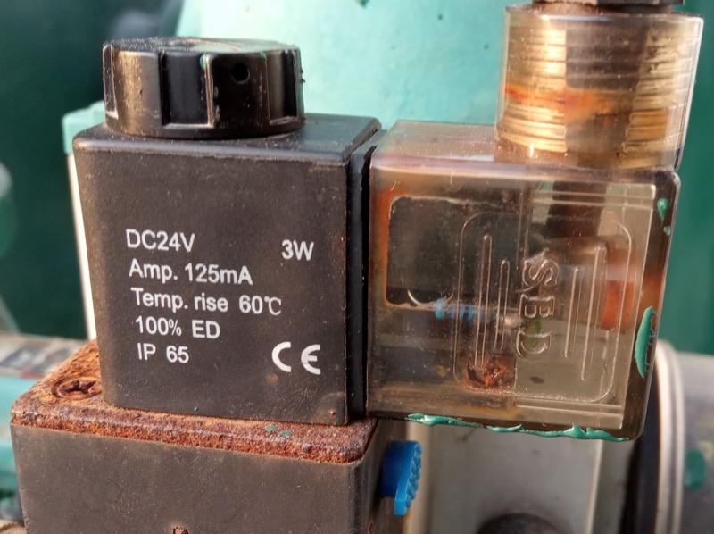

*Исполнительные устройства ★: соленоид NC 12 В ×2 (латунь 1/2"), MG996R ×2, реле 2‑кан.*

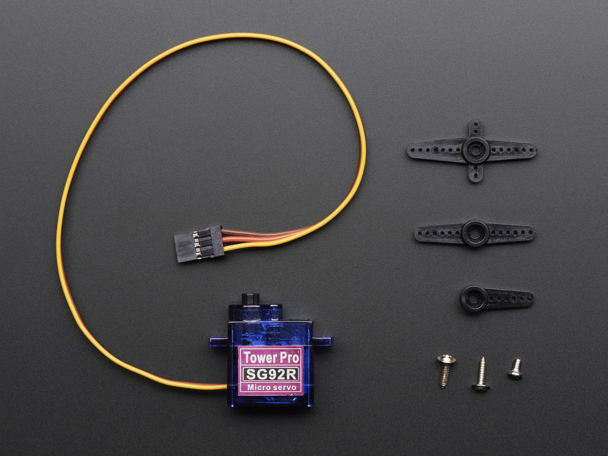

| Узел | Бюджет | Сбалансированный ★ | Премиум | Поиск |
|------|--------|-------------------|---------|-------|
| Клапан полива NC 12 В | Пластик 1/2" NC 12 V | **Латунь 1/2" NC 12 V** (Sanlixin SLP1DF12 или аналог) | Нержавейка 3/4" NC + фильтр | `соленоидный клапан 12V NC 1/2 латунь` |
| Клапан наполнения бака NC | То же | То же, второй экземпляр | С датчиком давления | |
| Серво окна ×2 | MG995 | **MG996R металл. шестерни** | DS3218MG 20 кг·см | `MG996R сервопривод` — [arduino54.ru](https://arduino54.ru/catalog/mehanika/servoprivody/servoprivod-mg996r-metallicheskie-shesterni-180-13-kg-sm-4-8-7-2-v/) |
| Реле для клапанов | 1‑кан. 10 А | **2‑кан. опто 12 В** (отдельно на каждый клапан) | SSR DC 12 В + предохранитель | `реле модуль 12V оптрон 2 канала` |

| Компонент | Кол-во | Цена ★, ₽ | Сумма, ₽ |
|--------|--------|-----------|----------|
| Соленоид NC 12 V 1/2" | 2 | 600–1 200 | 1 800 |
| MG996R | 2 | 400–550 | 900 |
| Реле 2‑кан (уже в щите) | — | — | — |
| **Итого актuators** | | | **~2 700** |

---

### 1.6. Сводная стоимость по сценариям

| Категория | Минимальный | Сбалансированный ★ | Максимальный |
|-----------|-------------|-------------------|--------------|
| Сервер HA (Pi + PoE + SSD) | Pi 4 + USB SSD ~15 000 | Pi 5 + NVMe ~22 700 | Pi 5 8 ГБ + 256 ГБ NVMe + Grafana ~35 000 |
| Сеть (если покупать с нуля) | 0 (есть Speedster, Keenetic PoE, Stellar 6) | 0 (есть Speedster, Keenetic PoE, Stellar 6) | 0 (есть Speedster, Keenetic PoE, Stellar 6) |
| Щит, ESP32, питание | ~14 000 | ~20 000 | ~28 000 (+ ИБП, premium щит) |
| Датчики | ~2 000 | ~3 100 | ~5 500 (SHT35, ультразвук) |
| Клапаны, серво, монтаж | ~2 000 | ~2 700 | ~6 000 |
| Кабель, мелочёвка, 10% запас | ~2 000 | ~3 500 | ~5 000 |
| **ИТОГО** | **~35 000 ₽** | **~52 000 ₽** | **~74 500 ₽** |

Поисковые запросы для сверки цен на Яндекс Маркете:

```
Raspberry Pi 5 4GB
ESP32 WROOM 32U DevKit
Mean Well LRS-100-12
SHT31 датчик влажности I2C
соленоидный клапан 12V NC полив
MG996R сервопривод
PCA9685 драйвер сервоприводов
щит IP65 300x400
```

---

## 2. Схема подключения

### 2.1. Общие правила монтажа в щите IP65

1. **Разделение питания:** БП 5 В (ESP32, датчики, PCA9685 логика) и БП 12 В (реле, соленоиды) — отдельные Mean Well; общая только «земля» (GND) в одной точке (звезда).
2. **NC‑клапаны:** без питания на катушке — закрыты. Реле **выключено** → клапан закрыт. При пропадании питания ESP32 реле разомкнуты → вода перекрыта.
3. **Flyback:** диод **1N4007** параллельно каждой катушке (реле/сolenoid): катод к «+» 12 В, анод к выходу реле.

   
4. **I2C:** короткие линии в щите; для выноса SHT/BH1750 в теплицу — FTP, SDA/SCL + 5 V + GND, экран на GND в одной точке у ESP32.
5. **OneWire (DS18B20):** экранированная пара, подтяжка 4.7 кΩ к 3.3 V на ESP32.
6. **Поплавок:** NO — замыкание на GND при высоком уровне (или NC — инверсия в ESPHome).

---

### 2.2. Распиновка ESP32 №1 — «Полив и бак» (`greenhouse-watering`)

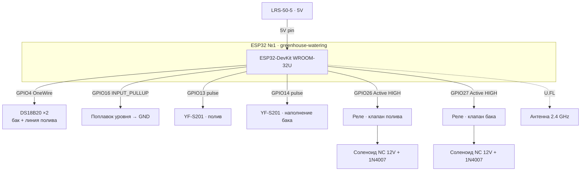

| GPIO | Назначение | Подключение | Примечание |
|------|------------|-------------|------------|
| — | Питание | USB или 5 V на 5V/VIN | От LRS‑50‑5 |
| GPIO4 | OneWire | DS18B20 #1, #2 (бак + линия полива) | Подтяжка 4.7 kΩ |
| GPIO16 | Цифровой вход | Поплавок уровня → GND | `INPUT_PULLUP`, инверсия при NO |
| GPIO13 | Pulse counter | YF‑S201 «полив» (сигнал) | 5 V питание датчика от 5 V БП |
| GPIO14 | Pulse counter | YF‑S201 «наполнение бака» | |
| GPIO26 | Выход реле | IN канал 1 → реле «клапан полива» | Active HIGH |
| GPIO27 | Выход реле | IN канал 2 → реле «клапан наполнения бака» | Active HIGH |
| GPIO21/22 | *Резерв I2C* | Не используются | |
| U.FL | Wi‑Fi | Внешняя антенна 2.4 ГГц | Вынести разъём за металл щита |

**Не использовать:** GPIO6–11 (flash), GPIO34–39 (только вход, без pull-up).

---

### 2.3. Распиновка ESP32 №2 — «Климат и окна» (`greenhouse-climate`)

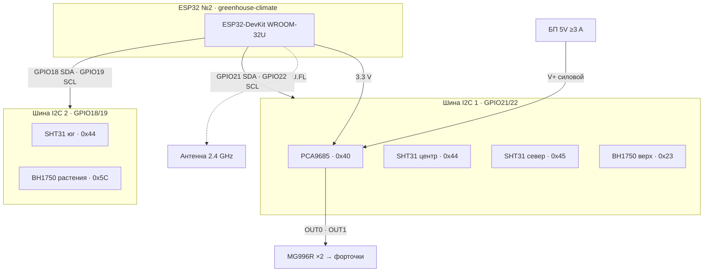

| GPIO | Назначение | Подключение | I2C‑адрес |
|------|------------|-------------|-----------|
| GPIO21 | I2C SDA | Шина 1: SHT31×2, BH1750 #1, PCA9685 | — |
| GPIO22 | I2C SCL | Шина 1 | — |
| GPIO18 | I2C SDA | Шина 2: SHT31 #3, BH1750 #2 | — |
| GPIO19 | I2C SCL | Шина 2 | — |
| — | PCA9685 V+ | Отдельные 5 V 3 A на сервоприводы | Не от USB ESP32 |
| U.FL | Wi‑Fi | Внешняя антенна | |

**I2C‑устройства на шине 1 (GPIO21/22):**

| Устройство | ADDR | Зона |
|------------|------|------|
| SHT31 «центр» | 0x44 (ADDR→GND) | Центр теплицы |
| SHT31 «север» | 0x45 (ADDR→3.3 V) | Северная сторона |
| BH1750 «верх» | 0x23 | Под потолком |
| PCA9685 | 0x40 | Драйвер серво |

**Шина 2 (GPIO18/19):**

| Устройство | ADDR | Зона |
|------------|------|------|
| SHT31 «юг» | 0x44 | Южная сторона |
| BH1750 «рабочая зона» | 0x5C (ADDR→3.3 V) | Уровень растений |

---

### 2.4. Подключение PCA9685 и сервоприводов MG996R

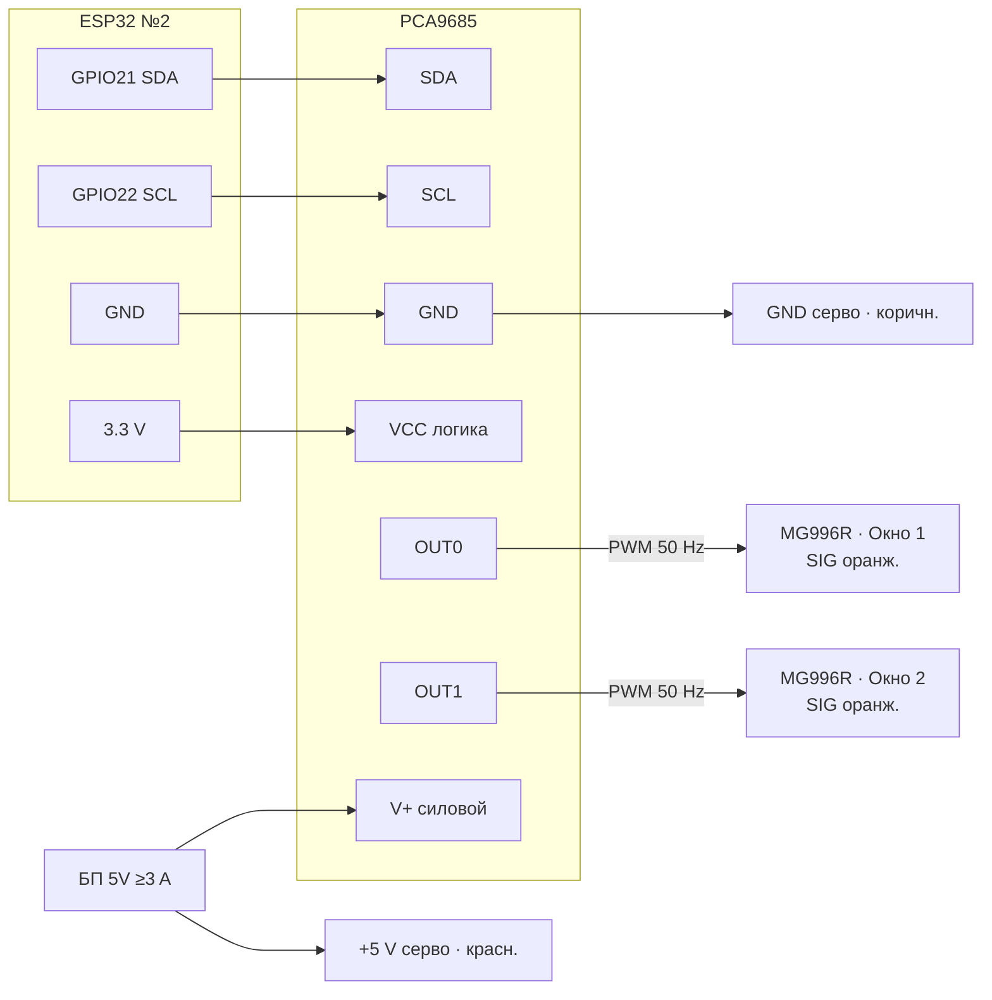

- Частота PWM для серво в ESPHome: **50 Hz**.
- При двух MG996R под нагрузкой обязателен **отдельный БП 5 V ≥ 3 A** на клемму V+ PCA9685.
- Механика: серво → рычаг → форточка; установить **концевые упоры** и калибровать угол в HA (0° = закрыто, 90° = приоткрыто).

---

### 2.5. Схема «откуда → куда» (щит IP65)

**Распределение питания** (5 V логика и 12 V нагрузки — отдельные БП, общая звезда GND):

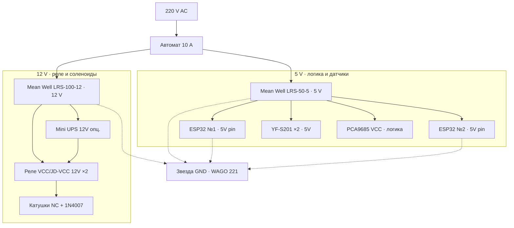

**Сигнальные и силовые связи щита** (FTP — вынос в теплицу):

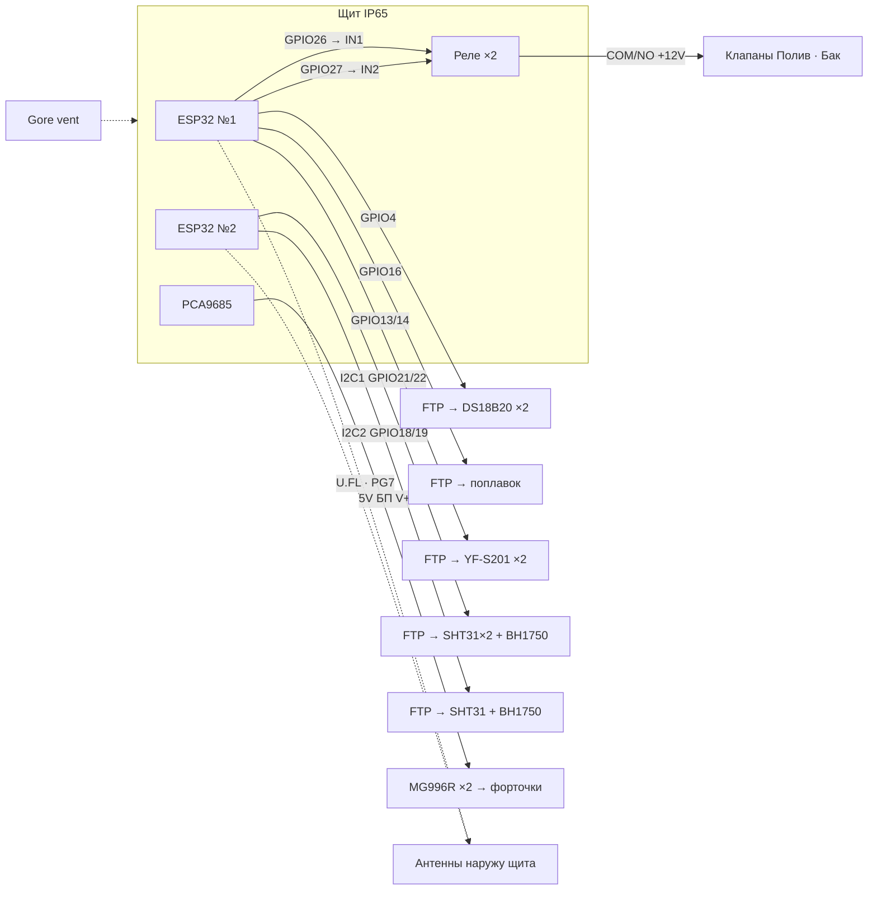

---

## 3. Настройка Wi‑Fi и Mesh

### 3.1. Топология

```
[Интернет] → Keenetic Speedster (главный, в доме)
                 │
                 ├── 5 GHz — SSID «Home» (телефоны, ноутбуки)
                 │
                 └── 2.4 GHz — SSID «IoT-GH» (фикс. канал 6)
                          │
                          └── Netcraze Stellar 6 (Mesh, ближе к теплице)
                                    │
                                    └── ESP32 #1, ESP32 #2 (~−55…−70 dBm)
```

**Netcraze Stellar 6** (арт. **NAP-650**; в международной линейке — Keenetic Stellar 6 / KAP-650) — уличная Mesh‑точка доступа Wi‑Fi 6 (AX3000) с PoE и влагозащищённым корпусом. Питание — от **Keenetic PoE‑коммутатора** в сетевом шкафу (Cat6 наружный до точки монтажа). В связке с **Keenetic Speedster** как контроллером Mesh она расширяет сегмент `IoT-GH` на 2.4 ГГц до щита ESP32 без отдельной настройки на extender. Для теплицы: установите узел **между домом и щитом IP65**, на расстоянии **~5 м от щита** (на высоте 1.5–2 м) — так оба ESP32 остаются в зоне уверенного приёма.

### 3.2. Отдельный SSID и фиксированный канал на Keenetic Speedster

**Шаг 1. Сканирование эфира**

1. На ноутбуке: WiFi Analyzer (Windows/Android) или `keenetic` → **Диагностика → Wi‑Fi монитор**.
2. Запишите занятость каналов 1, 6, 11. Выберите **наименее загруженный** (рекомендация: **канал 6**, ширина **20 MHz**).

**Шаг 2. Создание сегмента IoT (KeeneticOS 4.x)**

1. Веб‑интерфейс `192.168.1.1` → **Мои сети и Wi‑Fi** → **Сегменты сети** → **+ Добавить сегмент**.
2. Имя сегмента: `IoT_Greenhouse`.
3. IP‑подсеть: `192.168.30.0/24` (не пересекается с домашней `192.168.1.0/24`).
4. DHCP: включить, пул `192.168.30.100–192.168.30.200`.
5. **Wi‑Fi 2.4 GHz** → новая точка доступа:
   - SSID: `IoT-GH`
   - Пароль: длинная фраза (WPA2‑PSK минимум)
   - **Канал: 6** (вручную, не «Авто»)
   - **Ширина канала: 20 MHz**
   - **802.11 b/g/n**, отключить AX на этом SSID если есть опция (ESP32 — Wi‑Fi 4)
6. **5 GHz для IoT:** не создавать — ESP32 работает только 2.4 GHz.
7. Сохранить → **Применить**.

**Шаг 3. Mesh Netcraze Stellar 6**

1. Подключить Stellar 6 к порту **PoE** на Keenetic PoE‑коммутаторе в шкафу (Cat6, для улицы — наружный кабель).
2. **Mesh‑система** → убедиться, что Stellar 6 в режиме **Mesh‑точка**, не отдельный роутер.
3. На Stellar 6 **не транслировать отдельный SSID** — только backhaul + тот же `IoT-GH` с главного Speedster (единый SSID Mesh).
4. Разместить Stellar 6 **между домом и теплицей**, на высоте 1.5–2 м, антенны вертикально.

**Шаг 4. Резервирование IP для ESP32**

1. **Сегмент IoT** → DHCP → **Зарезервировать адрес** по MAC:
   - `greenhouse-watering` → `192.168.30.11`
   - `greenhouse-climate` → `192.168.30.12`

**Шаг 5. Минимизация роуминга ESP32**

| Мера | Действие |
|------|----------|
| Один SSID Mesh | Не дублировать гостевые/домашние SSID на 2.4 GHz |
| Фиксированный канал | Канал 6 на **всех** Mesh‑узлах 2.4 GHz (Speedster + Stellar) |
| Отключить Band Steering | Для сегмента IoT — только 2.4 GHz, без принудительного 5 GHz |
| Мощность TX | На IoT‑AP: 100%; на дальних AP — не выше, чем у ближнего (избегать «пинг‑понга») |
| `fast_connect` в ESPHome | Сохранение BSSID (см. YAML) — привязка к ближайшей точке |
| Размещение | Антенны ESP32 **снаружи** металлического щита, вертикально |
| Мониторинг | RSSI в ESPHome; при `< −85 dBm` — перезагрузка Wi‑Fi (см. конфиг) |

**CLI (опционально, привязка к BSSID Stellar 6):**

После первого подключения ESP32 запомните BSSID ближайшей точки (ESPHome лог / роутер «Клиенты»). В YAML: `bssid: "AA:BB:CC:DD:EE:FF"`.

Поиск: `Keenetic сегмент сети IoT`, `Keenetic фиксированный канал 2.4`

---

## 4. Прошивка и интеграция

### 4.1. Подготовка ESPHome

1. Home Assistant → **Настройки** → **Устройства и службы** → **Добавить интеграцию** → **ESPHome**.
2. Установить add-on **ESPHome** (если ещё нет).
3. Прошивка: USB первичная → далее OTA по Wi‑Fi.

Файлы конфигурации рекомендуется хранить в репозитории:

```
smart-greenhouse/
  esphome/
    greenhouse-watering.yaml
    greenhouse-climate.yaml
```

---

### 4.2. ESPHome — ESP32 №1 «Полив и бак»

```yaml
esphome:
  name: greenhouse-watering
  friendly_name: "Теплица — полив и бак"
  name_add_mac_suffix: false

esp32:
  board: esp32dev
  framework:
    type: arduino

logger:
  level: INFO

api:
  encryption:
    key: !secret api_encryption_key

ota:
  - platform: esphome
    password: !secret ota_password

wifi:
  ssid: !secret wifi_ssid_iot
  password: !secret wifi_password_iot
  fast_connect: true
  power_save_mode: none
  manual_ip:
    static_ip: 192.168.30.11
    gateway: 192.168.30.1
    subnet: 255.255.255.0
  # После первого подключения раскомментируйте BSSID ближайшей Mesh-точки:
  # bssid: "XX:XX:XX:XX:XX:XX"
  ap:
    ssid: "Greenhouse-Water Fallback"
    password: !secret ap_fallback_password

captive_portal:

sensor:
  - platform: wifi_signal
    name: "Полив — RSSI"
    id: wifi_rssi
    update_interval: 60s

  - platform: dallas_temp
    one_wire_id: bus_onewire
    name: "Бак — температура воды"
    id: tank_water_temp
    filters:
      - sliding_window_moving_average:
          window_size: 5
          send_every: 5

  - platform: dallas_temp
    one_wire_id: bus_onewire
    address: 0x000000000000  # заменить на реальный ROM после первого скана
    name: "Полив — температура воды"
    id: irrigation_water_temp

  - platform: pulse_counter
    pin:
      number: GPIO13
      mode: INPUT_PULLUP
    name: "Полив — расход"
    id: flow_irrigation
    unit_of_measurement: "L/min"
    accuracy_decimals: 2
    filters:
      - multiply: 0.00222  # YF-S201: ~450 имп/л → L/min (калибровать!)
    update_interval: 1s

  - platform: pulse_counter
    pin:
      number: GPIO14
      mode: INPUT_PULLUP
    name: "Бак — расход наполнения"
    id: flow_tank_fill
    unit_of_measurement: "L/min"
    accuracy_decimals: 2
    filters:
      - multiply: 0.00222
    update_interval: 1s

binary_sensor:
  - platform: gpio
    pin:
      number: GPIO16
      mode: INPUT_PULLUP
      inverted: true
    name: "Бак — высокий уровень"
    id: tank_level_high
    device_class: moisture

switch:
  - platform: gpio
    pin: GPIO26
    name: "Клапан полива"
    id: valve_irrigation
    restore_mode: ALWAYS_OFF
    icon: "mdi:sprinkler"

  - platform: gpio
    pin: GPIO27
    name: "Клапан наполнения бака"
    id: valve_tank_fill
    restore_mode: ALWAYS_OFF
    icon: "mdi:water-pump"

one_wire:
  - platform: gpio
    pin: GPIO4
    id: bus_onewire

interval:
  - interval: 5min
    then:
      - if:
          condition:
            lambda: 'return id(wifi_rssi).state < -85;'
          then:
            - logger.log: "RSSI низкий, перезагрузка Wi-Fi"
            - wifi.disable:
            - delay: 5s
            - wifi.enable:
```

---

### 4.3. ESPHome — ESP32 №2 «Климат и окна»

```yaml
esphome:
  name: greenhouse-climate
  friendly_name: "Теплица — климат и окна"
  name_add_mac_suffix: false

esp32:
  board: esp32dev
  framework:
    type: arduino

logger:
  level: INFO

api:
  encryption:
    key: !secret api_encryption_key

ota:
  - platform: esphome
    password: !secret ota_password

wifi:
  ssid: !secret wifi_ssid_iot
  password: !secret wifi_password_iot
  fast_connect: true
  power_save_mode: none
  manual_ip:
    static_ip: 192.168.30.12
    gateway: 192.168.30.1
    subnet: 255.255.255.0
  ap:
    ssid: "Greenhouse-Climate Fallback"
    password: !secret ap_fallback_password

captive_portal:

i2c:
  - id: bus_main
    sda: GPIO21
    scl: GPIO22
    scan: true
  - id: bus_secondary
    sda: GPIO18
    scl: GPIO19
    scan: true

sensor:
  - platform: wifi_signal
    name: "Климат — RSSI"
    id: wifi_rssi
    update_interval: 60s

  - platform: sht3xd
    i2c_id: bus_main
    address: 0x44
    update_interval: 30s
    temperature:
      name: "Теплица центр — температура"
      id: temp_center
    humidity:
      name: "Теплица центр — влажность"
      id: hum_center

  - platform: sht3xd
    i2c_id: bus_main
    address: 0x45
    temperature:
      name: "Теплица север — температура"
      id: temp_north
    humidity:
      name: "Теплица север — влажность"
      id: hum_north

  - platform: sht3xd
    i2c_id: bus_secondary
    address: 0x44
    temperature:
      name: "Теплица юг — температура"
      id: temp_south
    humidity:
      name: "Теплица юг — влажность"
      id: hum_south

  - platform: bh1750
    i2c_id: bus_main
    address: 0x23
    name: "Освещённость потолок"
    id: lux_ceiling
    update_interval: 60s

  - platform: bh1750
    i2c_id: bus_secondary
    address: 0x5C
    name: "Освещённость растения"
    id: lux_plants
    update_interval: 60s

  - platform: template
    name: "Теплица — средняя температура"
    id: temp_avg
    unit_of_measurement: "°C"
    lambda: |-
      return (id(temp_center).state + id(temp_north).state + id(temp_south).state) / 3.0;
    update_interval: 30s

  - platform: template
    name: "Теплица — средняя влажность"
    id: hum_avg
    unit_of_measurement: "%"
    lambda: |-
      return (id(hum_center).state + id(hum_north).state + id(hum_south).state) / 3.0;
    update_interval: 30s

pca9685:
  - id: pca9685_hub
    address: 0x40
    frequency: 50 Hz

output:
  - platform: pca9685
    id: pwm_window_1
    pca9685_id: pca9685_hub
    channel: 0
    min_power: 4.5%
    max_power: 10.5%

  - platform: pca9685
    id: pwm_window_2
    pca9685_id: pca9685_hub
    channel: 1
    min_power: 4.5%
    max_power: 10.5%

number:
  - platform: template
    name: "Окно 1 — угол"
    id: window_1_angle
    min_value: 0
    max_value: 90
    step: 1
    unit_of_measurement: "°"
    optimistic: true
    set_action:
      - servo.write:
          id: servo_window_1
          level: !lambda 'return x / 90.0;'

  - platform: template
    name: "Окно 2 — угол"
    id: window_2_angle
    min_value: 0
    max_value: 90
    step: 1
    unit_of_measurement: "°"
    optimistic: true
    set_action:
      - servo.write:
          id: servo_window_2
          level: !lambda 'return x / 90.0;'

servo:
  - id: servo_window_1
    output: pwm_window_1
    auto_detach: false

  - id: servo_window_2
    output: pwm_window_2
    auto_detach: false

cover:
  - platform: template
    name: "Форточка 1"
    id: vent_window_1
    has_position: true
    optimistic: true
    open_action:
      - number.set:
          id: window_1_angle
          value: 90
    close_action:
      - number.set:
          id: window_1_angle
          value: 0
    set_position_action:
      - number.set:
          id: window_1_angle
          value: !lambda 'return x * 90;'

  - platform: template
    name: "Форточка 2"
    id: vent_window_2
    has_position: true
    optimistic: true
    open_action:
      - number.set:
          id: window_2_angle
          value: 90
    close_action:
      - number.set:
          id: window_2_angle
          value: 0
    set_position_action:
      - number.set:
          id: window_2_angle
          value: !lambda 'return x * 90;'

interval:
  - interval: 5min
    then:
      - if:
          condition:
            lambda: 'return id(wifi_rssi).state < -85;'
          then:
            - wifi.disable:
            - delay: 5s
            - wifi.enable:
```

**Файл секретов** (`esphome/secrets.yaml`, не коммитить в git):

```yaml
wifi_ssid_iot: "IoT-GH"
wifi_password_iot: "ваш-длинный-пароль"
api_encryption_key: "сгенерировать через esphome secrets"
ota_password: "ваш-ota-пароль"
ap_fallback_password: "резервный-ap"
```

---

### 4.4. Добавление устройств в Home Assistant

1. ESPHome add-on → **+ New Device** → импорт YAML или wizard.
2. Первая прошивка по USB (ESP32 подключён к ПК с HA / esphome run).
3. После появления в сети `IoT-GH` — устройства автоматически обнаружатся (**ESPHome** → **Configure** → ввести ключ шифрования API).
4. Проверить **Настройки → Устройства** — два устройства ESPHome.

**Ожидаемые сущности:**

| Устройство | Сущности (entity_id*) |
|------------|----------------------|
| greenhouse-watering | `sensor.greenhouse_watering_bak_temperatura_vody`, `sensor.greenhouse_watering_poliv_rashod`, `binary_sensor.greenhouse_watering_bak_vysokiy_uroven`, `switch.greenhouse_watering_klapan_poliva`, `switch.greenhouse_watering_klapan_napolneniya_baka`, `sensor.greenhouse_watering_poliv_rssi` |
| greenhouse-climate | `sensor.teplitsa_tsentr_temperatura`, `sensor.teplitsa_srednyaya_vlazhnost`, `sensor.osveshchennost_potolok`, `cover.fortochka_1`, `cover.fortochka_2`, `number.okno_1_ugol` |

\* Точные `entity_id` зависят от версии HA; переименуйте в **Настройки → Устройства → Сущность → Имя**.

---

### 4.5. Примеры автоматизаций Home Assistant

Добавить в `configuration.yaml` или через **Настройки → Автоматизации → Создать → Редактировать в YAML**.

**1. Полив по влажности и времени (утро)**

```yaml
alias: "Теплица — полив по влажности"
description: "Полив 5 мин если средняя влажность < 55% и светло"
mode: single
trigger:
  - platform: time
    at: "07:00:00"
condition:
  - condition: numeric_state
    entity_id: sensor.teplitsa_srednyaya_vlazhnost
    below: 55
  - condition: numeric_state
    entity_id: sensor.osveshchennost_potolok
    above: 500
action:
  - service: switch.turn_on
    target:
      entity_id: switch.greenhouse_watering_klapan_poliva
  - delay: "00:05:00"
  - service: switch.turn_off
    target:
      entity_id: switch.greenhouse_watering_klapan_poliva
```

**2. Наполнение бака по уровню**

```yaml
alias: "Теплица — наполнение бака"
mode: single
trigger:
  - platform: state
    entity_id: binary_sensor.greenhouse_watering_bak_vysokiy_uroven
    from: "on"
    to: "off"
    for: "00:01:00"
condition:
  - condition: state
    entity_id: binary_sensor.greenhouse_watering_bak_vysokiy_uroven
    state: "off"
action:
  - service: switch.turn_on
    target:
      entity_id: switch.greenhouse_watering_klapan_napolneniya_baka
  - wait_for_trigger:
      - platform: state
        entity_id: binary_sensor.greenhouse_watering_bak_vysokiy_uroven
        to: "on"
    timeout: "00:10:00"
  - service: switch.turn_off
    target:
      entity_id: switch.greenhouse_watering_klapan_napolneniya_baka
```

**3. Защита от переполнения (аварийное отключение)**

```yaml
alias: "Теплица — защита переполнения бака"
mode: restart
trigger:
  - platform: state
    entity_id: binary_sensor.greenhouse_watering_bak_vysokiy_uroven
    to: "on"
    for: "00:00:05"
action:
  - service: switch.turn_off
    target:
      entity_id: switch.greenhouse_watering_klapan_napolneniya_baka
  - service: notify.persistent_notification
    data:
      title: "Теплица — переполнение бака"
      message: "Клапан наполнения принудительно закрыт."
```

**4. Проветривание по температуре и влажности**

```yaml
alias: "Теплица — проветривание"
mode: single
trigger:
  - platform: numeric_state
    entity_id: sensor.teplitsa_tsentr_temperatura
    above: 28
    for: "00:05:00"
  - platform: numeric_state
    entity_id: sensor.teplitsa_srednyaya_vlazhnost
    above: 85
    for: "00:10:00"
condition:
  - condition: or
    conditions:
      - condition: numeric_state
        entity_id: sensor.teplitsa_tsentr_temperatura
        above: 28
      - condition: numeric_state
        entity_id: sensor.teplitsa_srednyaya_vlazhnost
        above: 85
action:
  - choose:
      - conditions:
          - condition: numeric_state
            entity_id: sensor.teplitsa_tsentr_temperatura
            above: 32
        sequence:
          - service: cover.set_cover_position
            target:
              entity_id: cover.fortochka_1
            data:
              position: 100
          - service: cover.set_cover_position
            target:
              entity_id: cover.fortochka_2
            data:
              position: 100
    default:
      - service: cover.set_cover_position
        target:
          entity_id:
            - cover.fortochka_1
            - cover.fortochka_2
        data:
          position: 40
```

**5. Закрытие окон на ночь и при дожде (низкая освещённость + высокая влажность)**

```yaml
alias: "Теплица — закрыть форточки на ночь"
mode: single
trigger:
  - platform: sun
    event: sunset
    offset: "00:30:00"
  - platform: numeric_state
    entity_id: sensor.osveshchennost_potolok
    below: 10
    for: "00:15:00"
action:
  - service: cover.close_cover
    target:
      entity_id:
        - cover.fortochka_1
        - cover.fortochka_2
```

---

## 5. Диагностика и обслуживание

### 5.1. Чек‑лист после сборки

| № | Проверка | Ожидание | ✓ |
|---|----------|----------|---|
| 1 | Напряжение 5 V под нагрузкой | 4.95–5.10 V | |
| 2 | Напряжение 12 V | 11.8–12.2 V | |
| 3 | ESP32 #1/#2 в сети, ping | Ответ < 5 ms в LAN | |
| 4 | RSSI обоих ESP32 | > −75 dBm (цель), не ниже −85 | |
| 5 | Клапаны без питания | Закрыты (NC), нет течи | |
| 6 | Реле OFF → клапан | Закрыт | |
| 7 | Реле ON 2 с → клапан | Открыт, нет просадки 12 V > 0.5 V | |
| 8 | DS18B20 | Температура ±0.5 °C от эталона | |
| 9 | SHT31 (3 шт.) | Разброс < 1 °C / 3 % RH | |
| 10 | Поплавок | Срабатывание на полном баке | |
| 11 | YF‑S201 | Импульсы при ручном проливе | |
| 12 | Серво | 0° закрыто, 90° открыто, без дребезга | |
| 13 | OTA ESPHome | Обновление без USB | |
| 14 | HA история | Графики 24 ч без пропусков | |
| 15 | Автоматизации | Тест в «Режиме трассировки» | |
| 16 | Gore vent / сальники | Нет конденсата внутри щита | |

### 5.2. Типичные проблемы и решения

| Симптом | Вероятная причина | Решение |
|---------|-------------------|---------|
| ESP32 offline, RSSI < −90 | Слабый сигнал, металл щита | Вынести антенну, сдвинуть Stellar 6, зафиксировать BSSID |
| Частые reconnect | Роуминг Mesh, канал Auto | Фикс. канал 6, 20 MHz, `power_save_mode: none` |
| Ложное «переполнение бака» | Дребезг поплавка | Конденсатор 100 nF, `for:` 5–10 с в автоматизации |
| Расход 0 при поливе | Неправильная калибровка YF‑S201 | Подстроить `multiply`; проверить 5 V на датчике |
| SHT31 «nan» | Длина I2C > 3 m без pull-up | Pull-up 4.7 kΩ на SDA/SCL, FTP, снизить частоту I2C |
| Серво дёргается | Питание 5 V с ESP32 | Отдельный БП 5 V 3 A на V+ PCA9685 |
| Просадка 12 V при клапане | БП слабый / тонкие провода | LRS‑100‑12, сечение ≥ 1.5 mm², диод 1N4007 |
| Клапан не закрывается при сбое | Relay active‑low / NO вместо NC | Проверить тип реле; только NC‑клапаны |
| HA не видит сущности | API encryption mismatch | Переподключить интеграцию ESPHome, ключ из YAML |
| Корrosion в щите | Конденсат | Gore vent, силика‑гель, обогрев зимой опционально |

### 5.3. Резервное копирование и мониторинг

**Резервное копирование HA:**

1. **Настройки → Система → Резервные копии** → ежедневно 03:00, хранить 7 локально.
2. Автокопия на NAS / Nextcloud (Samba add-on или `ha backup upload`).
3. Экспорт YAML: `esphome/` конфиги, `automations.yaml`, `configuration.yaml` — в git‑репозиторий `smart-greenhouse`.
4. Документировать пароли в менеджере (не в git).

**Мониторинг:**

| Инструмент | Назначение |
|------------|------------|
| HA **System Monitor** | CPU/RAM/диск Pi |
| **ESPHome** RSSI sensors | Тренд Wi‑Fi |
| **Uptime Kuma** (add-on) | Ping ESP32, HA UI |
| **Alert** при offline > 5 min | notify Telegram/mobile |
| **Recorder** | `purge_keep_days: 30`, исключить частые pulse |
| Опционально **InfluxDB + Grafana** | Долгая история T/H, расход воды |

**Регламент обслуживания:**

- Еженедельно: просмотр графиков, тест ручного полива/форточки.
- Ежемесячно: очистка фильтра линии воды, осмотр сальников.
- Ежеквартально: OTA ESPHome + обновление HA (с бэкапом), калибровка расходомеров.
- Ежегодно: замена силика‑геля, проверка клапанов под давлением.

---

## 6. Безопасность

### 6.1. Сегментация сети (VLAN / IoT)

```
[Интернет]
    │
[Keenetic Speedster]
    ├── VLAN/Home  192.168.1.0/24  — ПК, телефоны (доверенные)
    ├── VLAN/IoT   192.168.30.0/24 — ESP32, камеры (ограниченные)
    └── VLAN/Mgmt  192.168.99.0/24 — коммутатор, AP (опц.)

Firewall (IoT → Home): DENY по умолчанию
Firewall (Home → IoT): ALLOW только HA (192.168.1.x → ESP32:6053 API)
Firewall (IoT → Internet): DENY (ESP32 не нужен выход в интернет после OTA)
```

**Keenetic — правила межсегментного экрана:**

1. **Правила и политики → Межсетевой экран → IoT_Greenhouse**.
2. Запретить: `IoT → Любой → Домашняя сеть` (192.168.1.0/24).
3. Разрешить: `Домашняя → IoT → TCP 6053` (ESPHome native API, если используется).
4. Запретить: `IoT → Интернет` (или разрешить только NTP при необходимости).

### 6.2. Доступ к ESP32

| Мера | Реализация |
|------|------------|
| Нет прямого интернета | Firewall deny IoT WAN |
| OTA | Только из LAN через HA ESPHome add-on |
| API encryption | `api.encryption.key` в YAML |
| OTA password | Обязательно |
| Fallback AP | Отключать после стабилизации (`ap_timeout: 0` или без AP в prod) |
| mDNS | Доступ к `greenhouse-watering.local` только из LAN |

### 6.3. Обновление прошивок

1. **ESPHome:** подписаться на [ESPHome releases](https://github.com/esphome/esphome/releases); обновлять add-on → Compile → OTA (по одному устройству).
2. **Home Assistant:** Core/OS — раз в месяц после бэкапа; читать release notes.
3. **Keenetic:** KeeneticOS stable channel; не включать beta на production.
4. Откат ESPHome: хранить предыдущий `.bin` из ESPHome dashboard.

### 6.4. Физическая безопасность

- Автомат 10 A и УЗО на линии 220 V в щите теплицы.
- Заземление корпуса металлического щита.
- Клапаны NC — **fail‑safe** при обесточивании.
- ИБП 12 V только для удержания клапанов в безопасном состоянии (закрыты).

### 6.5. Чек‑лист безопасности

- [ ] IoT в отдельной подсети / VLAN
- [ ] ESP32 без доступа в интернет
- [ ] Уникальные пароли Wi‑Fi / OTA / API
- [ ] Резервные копии HA зашифрованы
- [ ] SSH/Port forwarding на HA не открыт в интернет без VPN
- [ ] Доступ к HA UI через HTTPS (Nginx Proxy / Cloudflare Tunnel + 2FA)

---

## Приложение A. Структура репозитория (рекомендуемая)

```
smart-greenhouse/
├── docs/
│   └── smart-greenhouse-design.md    ← этот документ
├── esphome/
│   ├── greenhouse-watering.yaml
│   ├── greenhouse-climate.yaml
│   └── secrets.yaml                ← в .gitignore
├── homeassistant/
│   └── automations/
│       └── greenhouse.yaml
├── Task.md
└── README.md
```

## Приложение B. Полезные ссылки

- [ESPHome — Pulse Counter](https://esphome.io/components/sensor/pulse_counter.html)
- [ESPHome — PCA9685](https://esphome.io/components/output/pca9685.html)
- [Keenetic — Сегменты сети](https://support.keenetic.com/hero-4g-plus/kn-2311/en/14628-network-segments.html)
- [Keenetic Speedster — Wi‑Fi 2.4 GHz](https://support.keenetic.ua/speedster/kn-3013/uk/14630-2-4-ghz-wi-fi-network.html)
- [Home Assistant — Backup](https://www.home-assistant.io/common-tasks/general/#backups)

---

*Документ подготовлен для проекта smart-greenhouse. Перед монтажом сверьте GPIO, I2C‑адреса и калибровку расходомеров на стенде.*
